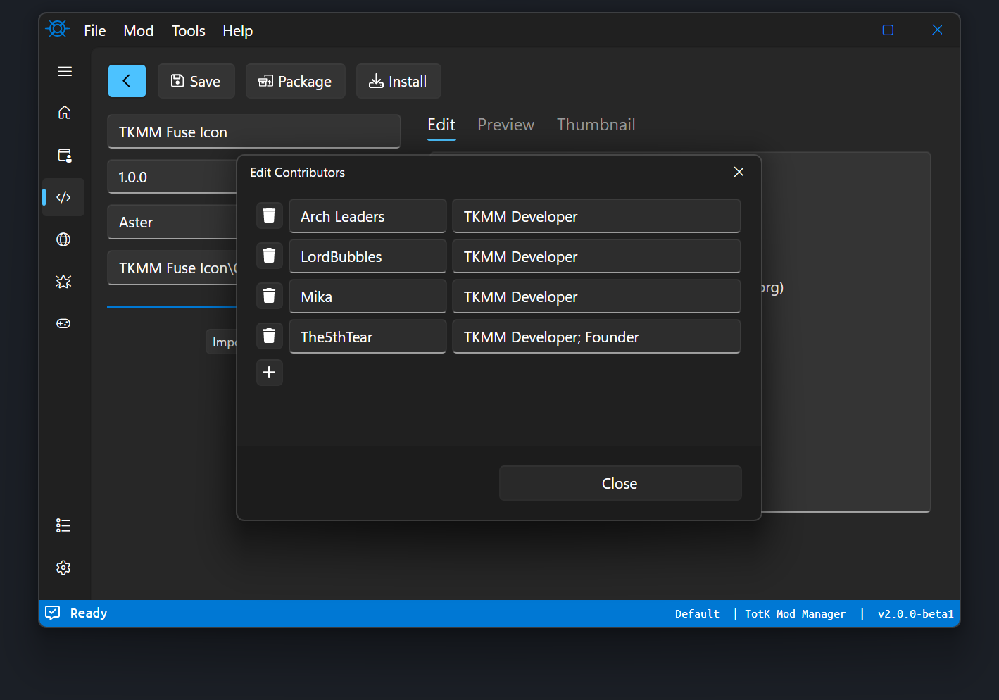

# Packaging

This page will walk you through all features in the Projects section of TKMM. To begin, select `New Project`, and navigate to the folder containing the `romfs`, `exefs`, and/or `cheats` folder. If you already have a saved project, you can navigate to the `.tkproj` (TKMM Project) file using the `Open Project` button, or choose it from the `Recent Projects` list by double-clicking on the name of the project.


<p>
    
</p>

## Basic Fields

When creating a new project, you should see the following screen:

<p>
    
</p>

### Name

The `Name` field is for the title of the mod. It will be displayed in the Mod List on TKMM's home page to represent the mod.

### Version

The `Version` field is for the version of the mod. It's recommended to use `1.0.0` for the first release of a mod, and using a higher numbered version for updates. You may use any`1.0.0` is filled in by default.


### Authors

The `Author` field is for specifying the mod's primary author. This field will be automatically filled if you configured the `Default Author` field in the `Packaging` tab of TKMM's Settings. If more than one author contributed to the mod, click on the `…` on the right side of the `Author` field. Press the `+` button and two fields will appear. The field on the left is for specifying the name of an additional contributor. The field on the right is for listing their contributions to the mod. If they made multiple contributions, each contribution can be separated by a semicolon. For example: `Models; Textures; Sounds`. Press `Close` to confirm your changes and exit the additional contributors window.

<p>
    
</p>

### Thumbnail

The `Thumbnail` field is for the path to the mod's thumbnail image. Acceptable image formats include `bmp`, `gif`, `jpg`, `jpeg`, `png`, and `tif`. Note that only the first frame of a `gif` will be used as a thumbnail. To preview your thumbnail, click on the `Thumbnail` header on the far right of the Packaging tab.

### Description

The `Description` field is on the far right side of the Packaging tab. Fill it in with a description of your mod. You can use markdown formatting, a guide for which can be found [here](https://www.markdownguide.org/basic-syntax/). To preview the description, click the `Preview` header. Click on the `Edit` header to get back to the description editor.

### Packaging

 When you are satisfied with the packaging settings, click the `Package` button to export the `TKCL` to a path of your choosing, or click `Install` to install the mod for testing purposes. 
 
 >[!TIP]
 >Whether you're Packaging or Installing a mod, click `Save` to save the `.tkproj` file to the root directory of the mod. 
 > Through the use of a `.tkproj` file, all data from the packaging screen is saved.
 > This enables you create updates for your mod that use the same internal ID, so when a user installs a newer version of your mod, it will automatically replace the original version they had installed.

 ## Mod Options

When packaging a TKCL, mod creators can add user-configurable options to their mod. These options are different configurations of files that the mod user can customize to better tailor their experience. There is no minimum or maximum limit to the amount of Option Groups a TKCL can include. When adding option groups, a description and thumbnail can be added to each option to explain to the end-user what each option group is used to configure. The thumbnail and description of an option group is visible to the user by hovering over the title of the option group.

<p>
    
</p>

As an alternative to manually importing option groups in TKMM, you can have option groups automatically detected when you select the `Mod Folder` by laying out the option group in the mod's folder structure. Here is an example of the folder structure:

```
├── thumbnail.jpg
├── romfs/
└── options/
    ├── OptionGroup1Name/
    │   ├── thumbnail.jpg
    │   ├── Option1Name/
    │   │   └── romfs/
    │   ├── Option2Name/
    │   │   └── romfs/
    │   └── Option3Name/
    │       └── romfs/
    │
    ├── OptionGroup2Name/
    │   ├── thumbnail.jpg
    │   ├── Option1Name/
    │   │   └── romfs/
    │   ├── Option2Name/
    │   │   └── romfs/
    │   └── Option3Name/
    │       └── romfs/
    │
    └── OptionGroup3Name/
        ├── thumbnail.jpg
        ├── Option1Name/
        │   └── romfs/
        ├── Option2Name/
        │   └── romfs/
        └── Option3Name/
            └── romfs/
```

There are four types of option groups:

**Single**  groups allow the user to pick 1 option from the group.

**SingleRequired** groups require the user to pick exactly one of the option group's options.

**Multi** groups allows the user to pick as many or as few of the options as they'd like.

**MultiRequired** groups require the user to pick one or more of the options in the group.

>[!NOTE]
> You can configure the relative priority of option groups compared to one another, with 0 being the lowest priority. If you're creating a `Multi` or `MultiRequired` Option Group, you can configure the relative priority of options within each of those groups.