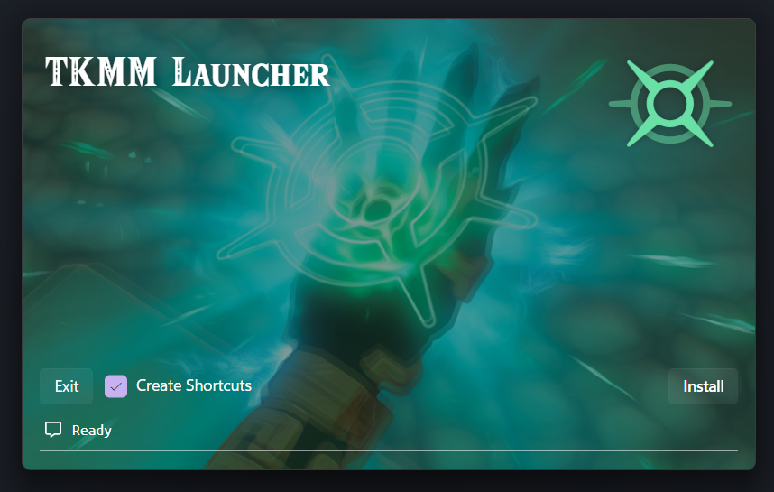
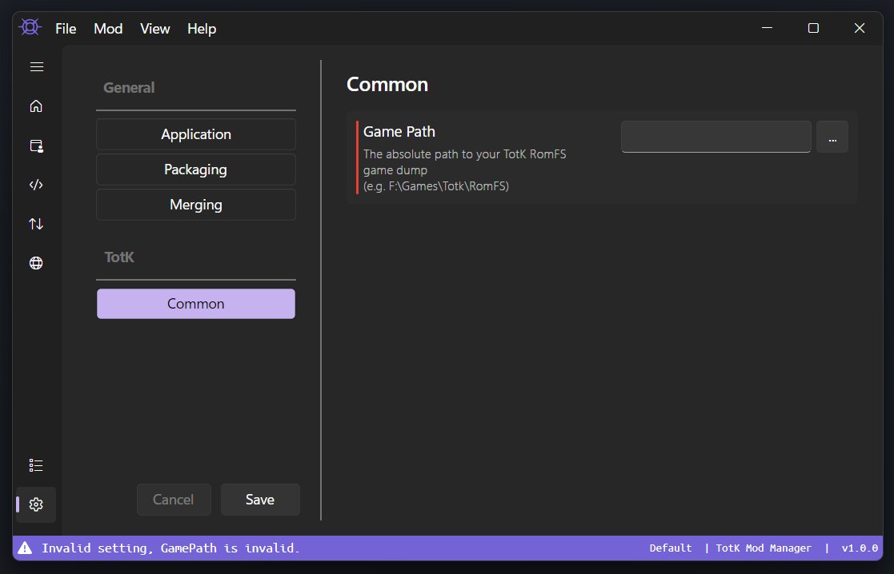
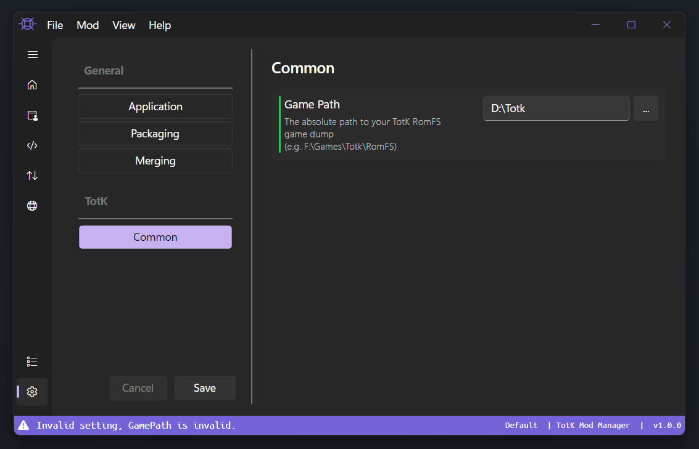

# TKMM Installation & Setup

> [!IMPORTANT]
> Before starting, make sure you have downloaded and installed the [.NET 8 runtime](../../downloads) from the [downloads](../../downloads) page.
>
> If this step is not completed, the application will instantly crash.

---

## Installation

From the [downloads](../../downloads) page, locate the correct version for your operating system.

Click one of the options for `TKMM Launcher` to download a `zip` file containing the `tkmm-launcher` executable. When the download has completed, extract and run this executable.

If the correct [.NET runtime](../../downloads) is installed, the following window will open.

    

> [!WARNING]
> If you are installing on the Steam Deck and/or cannot run as the super-user, uncheck `Create Shortcuts` to avoid needing elevated permissions.

Click `Install` to begin the installation process.

When the installation completes, click `Launch` to open TKMM.

## Setup

When TKMM first starts, you will likely be asked to configure your game path.

    

> [!IMPORTANT]
> If you do not already have the game dump on your computer, please google how to do it.

Once you have the game dump, use the `...` button to browse to that location.

> If the setting did not turn green, make sure you have a complete game dump and you selected the right folder (it will be the folder containing `ActorSystem`, `AI`, `AISchedule`, etc.).

When everything is done correctly, you should have something similar to this.

    

To learn more about configuring the TKMM settings, read through the [settings](./settings) page.