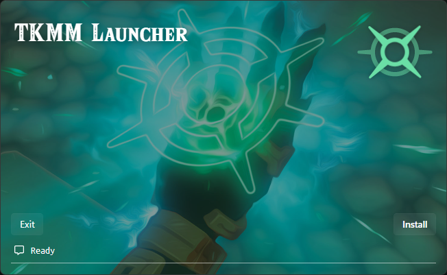
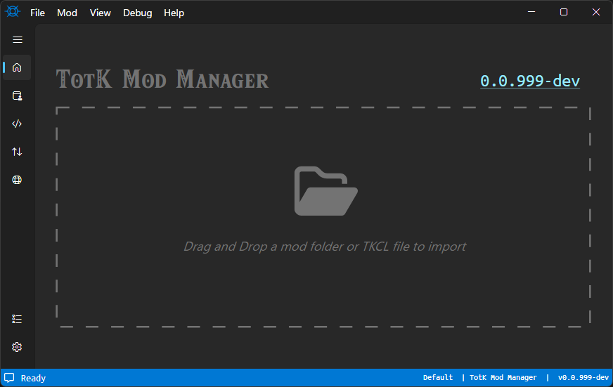

# TKMM Installation & Setup

> [!IMPORTANT]
> Before starting, make sure you have downloaded and installed the [.NET 8 runtime](../../downloads) from the [downloads](../../downloads) page.
>
> If this step is not completed, the application will instantly crash.

---

## Setup

From the [downloads](../../downloads) page, locate the correct version for your operating system.

Click one of the options for `TKMM Launcher` to download a `zip` file containing `tkmm-launcher`. When the download has completed, extract and run the executable.

If the correct [.NET runtime](../../downloads) is installed, the following window will open.

    

Once installation is complete, the Install button should change to say Launch. Click Launch to open TKMM. Once TKMM loads, you should land on the home screen.

Go to the next section of the wiki to learn about how to configure the Settings for TKMM.