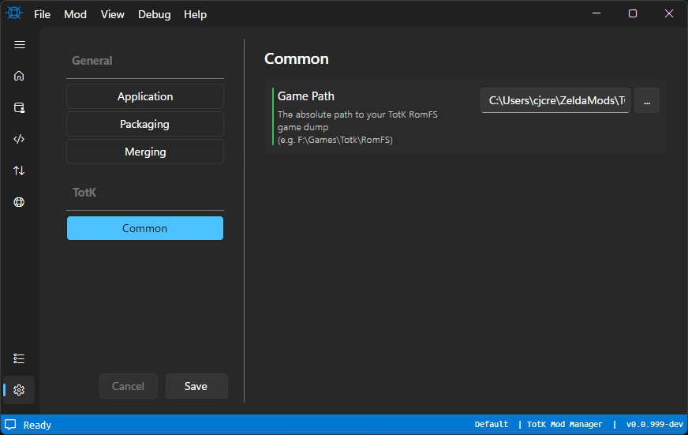
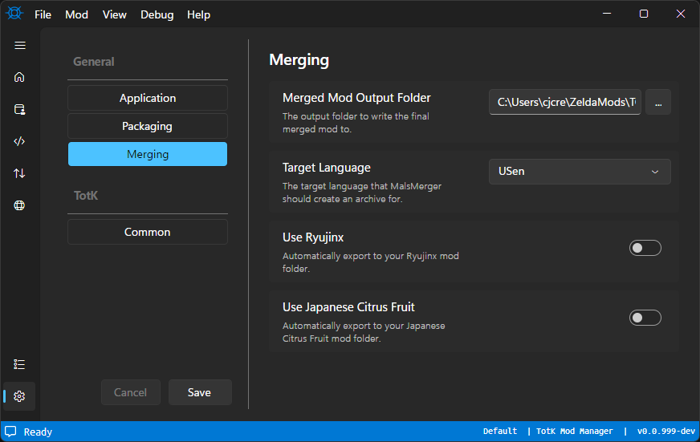

# TKMM Installation & Setup

> [!IMPORTANT]
> Before starting, make sure you have downloaded and installed the [.NET 8 runtime](../../downloads) from the [downloads](../../downloads) page.
>
> If this step is not completed, the application will instantly crash.

---

## Setup

From the [downloads](../../downloads) page, locate the correct version for your operating system.

Click one of the options for `TKMM Launcher` to download a `zip` file containing `tkmm-launcher`. When the download has completed, extract and run the executable.

If the correct [.NET runtime](../../downloads) is installed, the following window will open.

    

Once installation is complete, the Install button should change to say Launch. Click Launch to open TKMM. Once TKMM loads, you should land on the home screen.

 If you click on the three lines near the top left of the window, the navigation sidebar will expand to show the names of each tab. Click on the **Settings** tab, which is represented by the cogwheel icon.

For all users, whether you plan to use TKMM to package mods or to merge mods to play with them, you will need to specify your game dump location. In the **Common** settings category, shown in the above image, choose the folder that contains a full romfs dump of Tears of the Kingdom. This is the folder that contains many other directories, such as a `Model` folder, a `Pack` folder, a `TexToGo` folder, and many others. Note that the version of your game dump is the version that TKMM will export mods for. For example, if your game dump is from v1.1.2 of TOTK, then TKMM's merged mod folder will be compatible with v1.1.2. TKMM's merging system is version agnostic, meaning that regardless of the game version a mod was made for, TKMM can export it to the version of your game dump.

Next, select the **Merging** tab. Here is an image of this tab, followed by a description of each of the options:

1. Merged Mod Output Folder

This is where you can choose the output path for your mods when you merge them. When you merge mods, the contents of this folder will be deleted, so it's recommended to create a new folder for this.

2. Target Language

If you are using a mod that edits the localization files found in the **Mals** folder in the romfs, there is a chance that it doesn't support all languages. If the language entry for a given string does not exist for a given language, it will appear in game as *MsgNotFound*. If you choose your target language, TKMM is able to automatically move a mod's localization edits to the file for your language, removing the *MsgNotFound* issues.

3. Use Ryujinx

By enabling this option, merging your mods will automatically export a copy of your Merged Mod Output Folder to the default mods path for Ryujinx. This is a quality of life option that mitigates the need for you to move your merged export to the emulator's mods folder yourself.

4. Use Japanese Citrus Fruit

By enabling this option, merging your mods will automatically export a copy of your Merged Mod Output Folder to the default mods path for Japanese Citrus Fruit. This is a quality of life option that mitigates the need for you to move your merged export to the emulator's mods folder yourself.