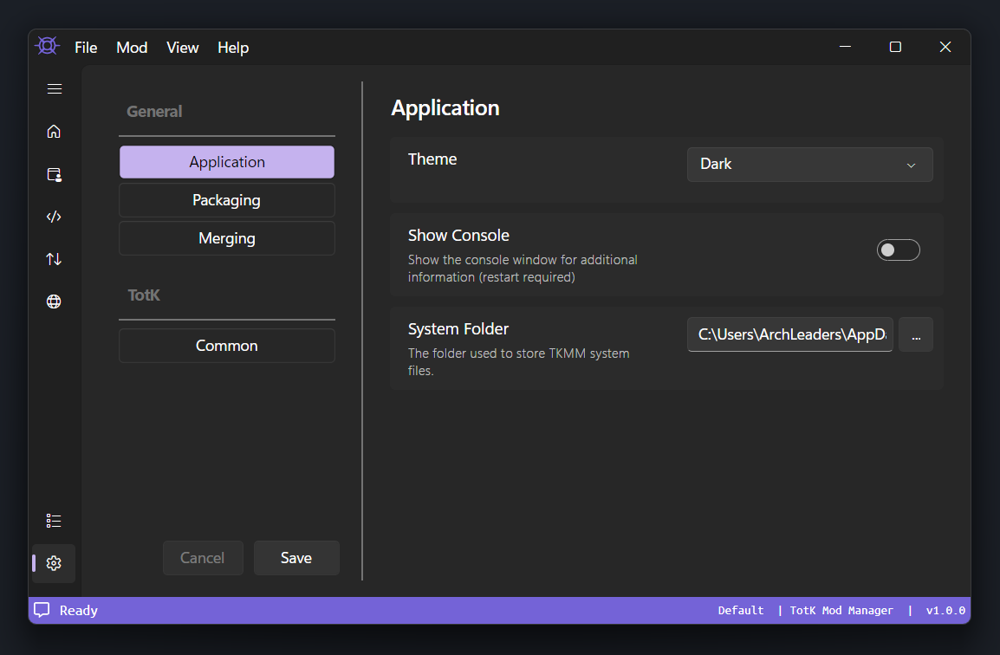
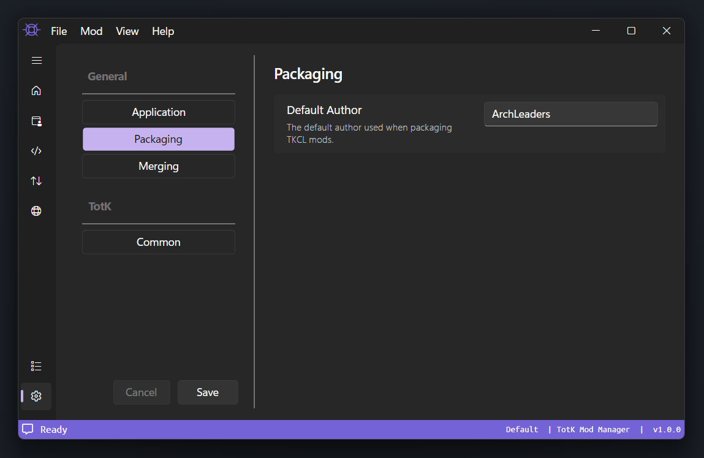
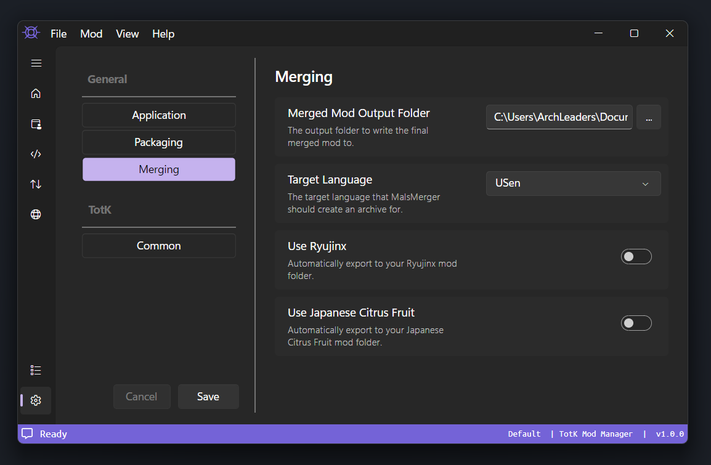

## Application Settings

    

---

### Theme

Controls the application theme. Options are `Dark` and `Light` (default is the system theme).

### Show Console

> \**Windows Only*

Controls whether or not the system console (command prompt) should remain open in the background.

This can be useful for debugging and reporting errors.

### System Folder

This is the folder where your mods and profiles are stored.

> [!NOTE]
> Unless you have low disk space on your system drive, it is recomended to leave this as the default.

---

## Packaging Settings

    

---

### Default Author

Controls is the default name to use when packaging new mods.

> [!IMPORTANT]
> By default this is your computers username. Make sure this does not contain sensetive information that may be packaged and deplyed in mods.

---

## Merging Settings

    

---

### Merged Mod Output Folder

This is the folder where your merged mod is saved.

> [!IMPORTANT]
> This folder can be deleted, do not set it to a folder with any contents.
>
> If you are unsure, leave this setting as the default.

### Target Language

Controls the language to prefer when merging mods.

### Use Ryujinx

When enabled, merged mods are automatically exported to the Ryujinx emulator's mod folder.

### Use Japanese Citrus Fruit

When enabled, merged mods are automatically exported to the [Japanese Citrus Fruit](https://www.google.com/search?q=japanese+citrus+fruit) emulator's mod folder.