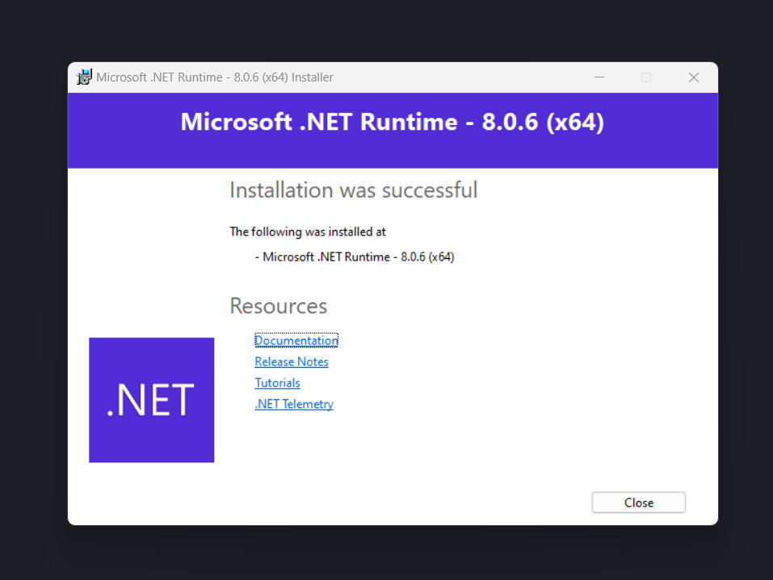
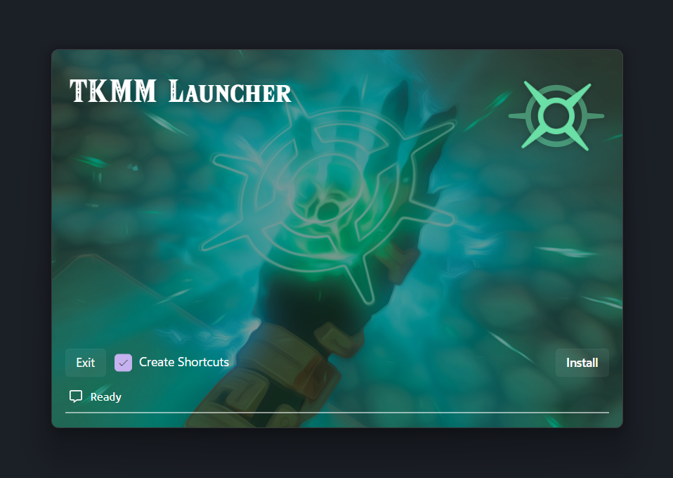
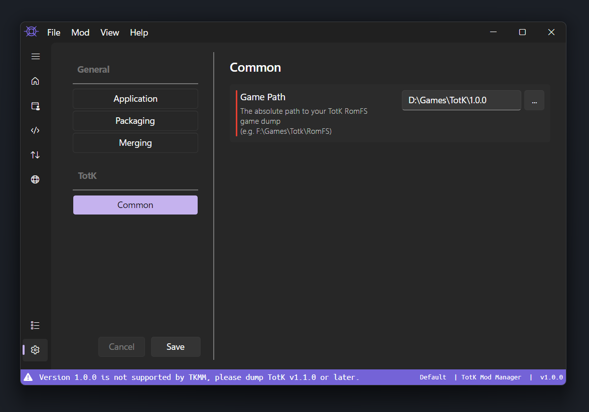
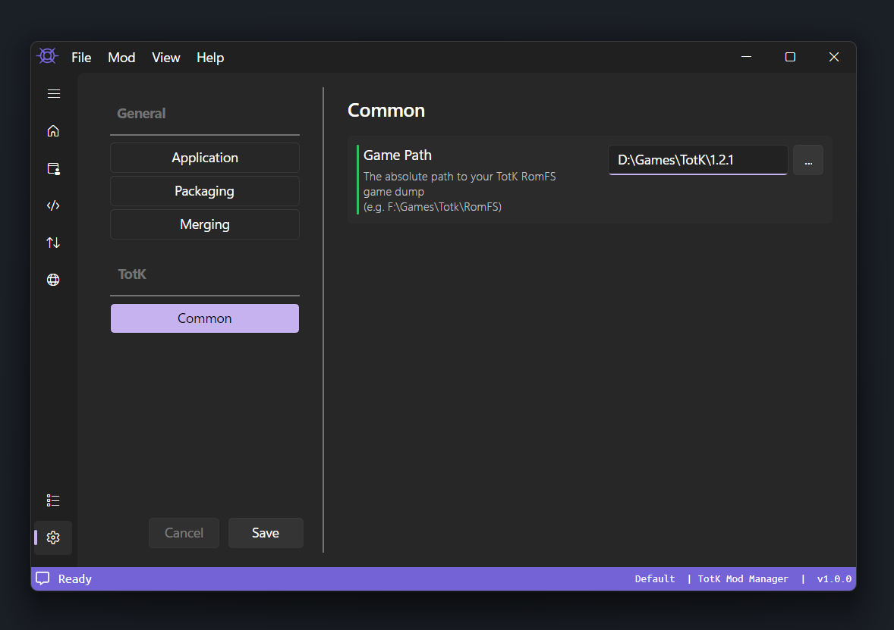

# Getting Started

This guide will walk through installing and setting up TKMM.

To learn how to install and merge mods, check out the [Using Mods](./using-mods/) guide.

## Installation

On the [downloads](../downloads) page, locate and download the <kbd><samp>TKMM Launcher</samp></kbd> and <kbd><samp>.NET Runtime</samp></kbd> for your operating system.

When the downloads have completed, open the **.NET Runtime** installer and follow the prompts to completion.

    

Once the **.NET Runtime** has finished installing, extract the **TKMM Launcher** zip file and run the contained executable.

The following window will open.

    

Click <kbd><samp>Install</samp></kbd> to begin the installation process.

> [!IMPORTANT]
> The TKMM installer requires a stable internet connection.

When the installation completes, click <kbd><samp>Launch</samp></kbd> to open TKMM.

## Setup

When TKMM first starts, you will most likely be asked to configure your game path.

    

This field contains the path to your Tears of the Kingdom romfs game dump.

If you do not already have the game dump on your computer, please follow [this guide](https://zeldamods.org/wiki/Help:Dumping_games#Switch) to legally obtain one.

> [!IMPORTANT]
> When dumping your copy of the game, make sure you include the `1.1.0` update or later. `1.0.0` is [not supported by TKMM](/faq/#why-cant-i-use-version-100).

    

Once you have dumped your copy of the game to romfs, use the <kbd><samp>...</samp></kbd> button to browse to it's location.

When the game path is set correctly the field will turn green.

    

> [!NOTE]
> TKMM will output mods for the same version as the provided game dump.
>
> For example, if you are playing on `v1.1.2`, make sure your game dump is for `v1.1.2` as well.