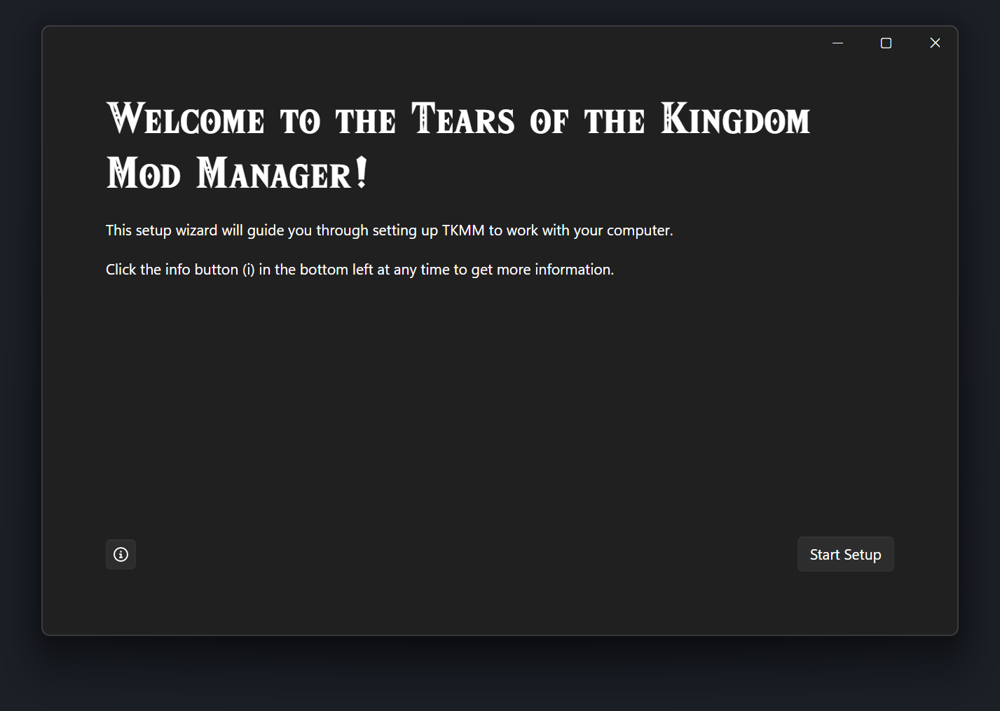
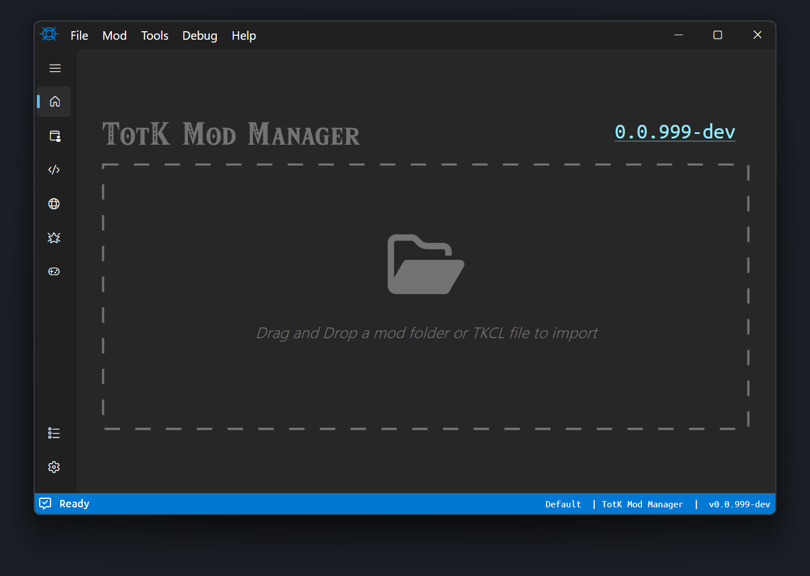

# Getting Started

This guide will walk through installing and setting up TKMM.

To learn how to install and merge mods, check out the [Using Mods](./using-mods/) guide.

## Installation

Navigate to the [downloads](../downloads) page and download the version for your operating system.

After downloading the version for your operating system, extract the archive contents file and run the contained executable. The following window will open.

> [!IMPORTANT]
> TKMM user data (I.e. mods and profiles) is stored next to the executable. 
> To avoid errors, avoid moving your TKMM installation, or move the entire installation folder.

    

Follow the setup wizard to configure the game dump and language for TKMM. 

> [!NOTE]
> TKMM will output mods for the same version as the provided game dump.
>
> For example, if you are playing on `v1.1.2`, make sure your game dump is for `v1.1.2` as well.
> Multiple game dump versions can be provided, and you can choose which version to output mods for from the Settings tab.

Once finished, you will land on the mods tab as shown below.

    

