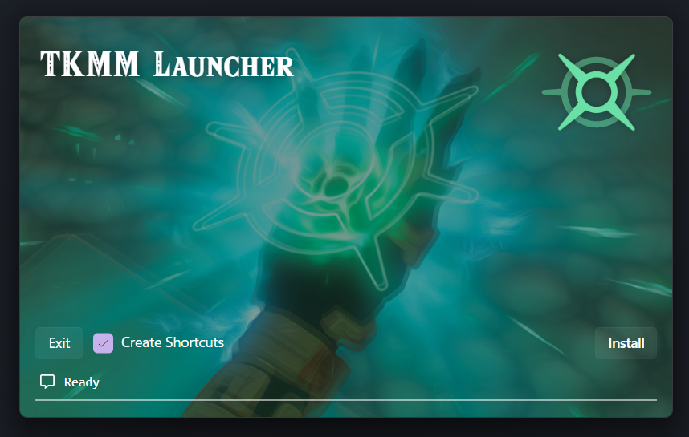
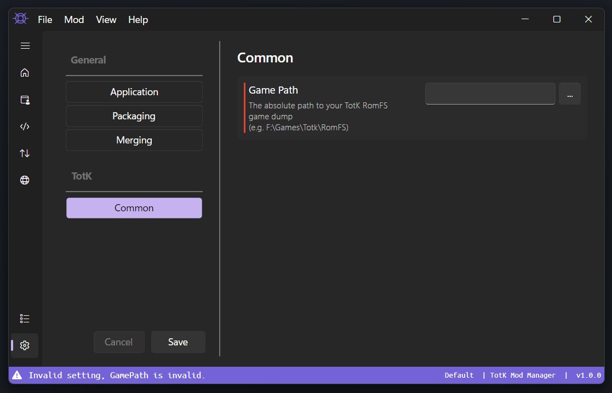
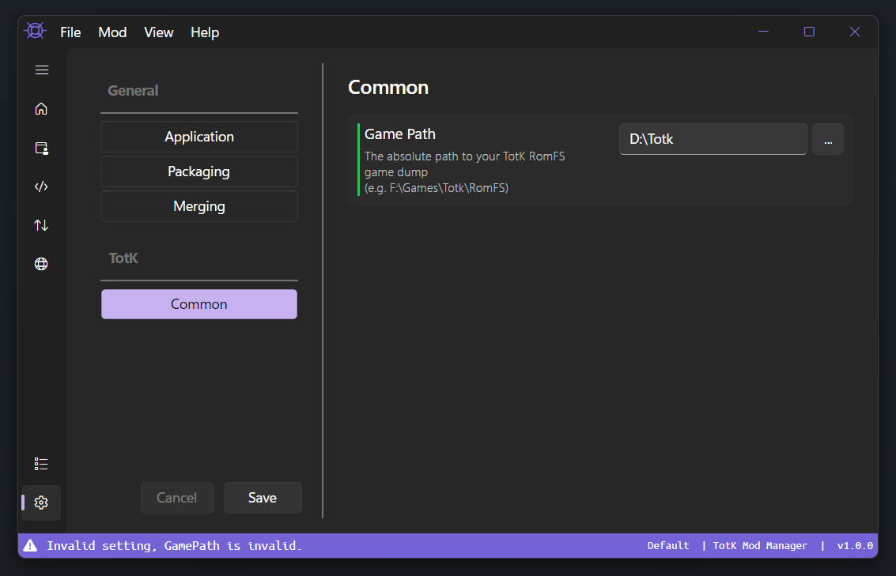

# TKMM Installation & Setup

> [!IMPORTANT]
> Before starting, make sure you have downloaded and installed the [.NET 8 runtime](../downloads) from the [downloads](../downloads) page.
>
> If this step is not completed, the application will instantly crash.

---

## Installation

From the [downloads](../downloads) page, locate the correct version for your operating system.

Click one of the options for `TKMM Launcher` to download a `zip` file containing the `tkmm-launcher` executable. When the download has completed, extract and run this executable.

If the correct [.NET runtime](../downloads) is installed, the following window will open.

    

> [!WARNING]
> If you are installing on the Steam Deck and/or cannot run as the super-user, uncheck `Create Shortcuts` to avoid needing elevated permissions.

Click `Install` to begin the installation process.

When the installation completes, click `Launch` to open TKMM.

## Setup

When TKMM first starts, you will likely be asked to configure your game path. 

    

The accent color used in TKMM will vary based on your system's accent color.

> [!NOTE]
> If you do not already have the game dump on your computer, please follow [this guide](https://dardel.codeberg.page/nxdumpguide/), following the `Proceed to Dumping RomFS (Modders)` after following the first page of instructions.

Once you have the RomFS dump, use the `...` button to browse to that location.

> If the setting did not turn green, make sure you have a complete game dump and you selected the right folder (it will be the folder containing `ActorSystem`, `AI`, `AISchedule`, etc.).

When the dump path has been set correctly, the stripe to the left of the `Game Path` text will turn green, as shown below.

> [!IMPORTANT]
> TKMM will output mods for the same version as the provided game dump.
>
> For example, if you are playing on `v1.1.2`, make sure your game dump is for `v1.1.2` as well.

    

> [!NOTE]
> Even when the game path is correct, the status bar will still show an `Invalid setting, GamePath is invalid.` error. Click the `Save` button in the bottom left to resolve this and save the settings.
>
> Starting with TKMM 1.0.0-beta11, settings will be automatically saved by default, but this can be toggled off.

To learn more about configuring the TKMM settings, read through the [Settings](./settings) page.

To get started using mods, check out the [Using Mods](./using-mods) page.