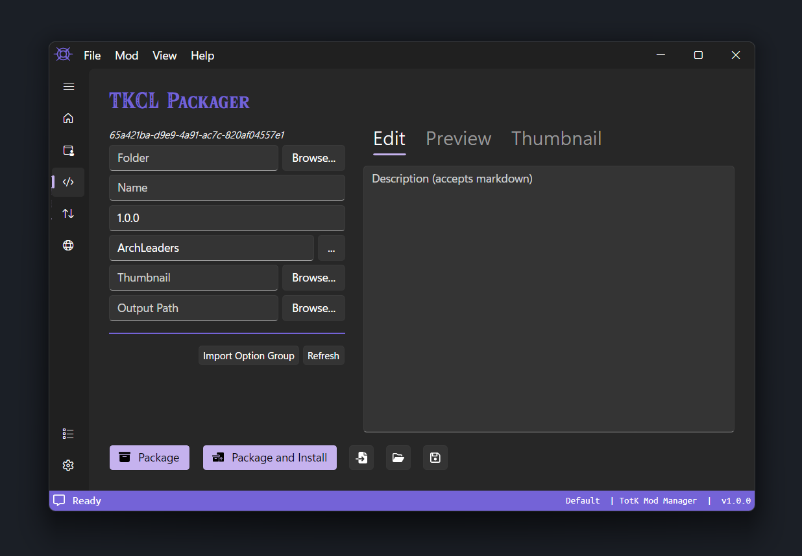
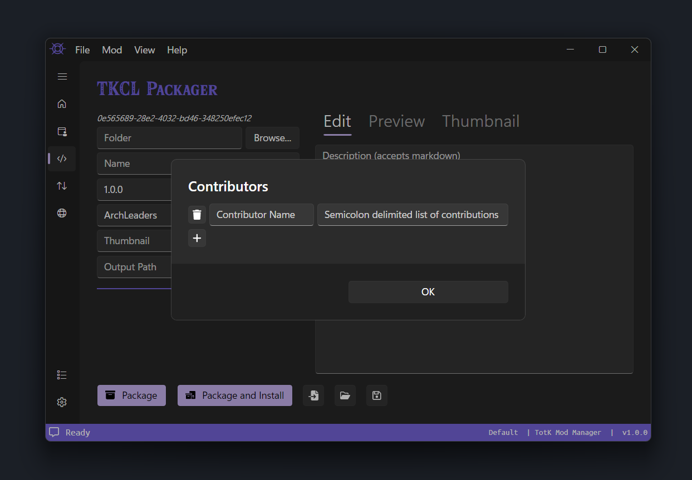

# Packaging

This page will walk you through packaging a mod with TKMM, including the creation of option groups.

## Basic Fields

    

### Folder

The `Folder` field is for the path to the root folder of the mod you want to package. This folder should contain the `romfs` and/or `exefs` folder.

### Name

The `Name` field is for the name of the mod. It will be displayed in the Mod List on TKMM's home page to represent the mod.

### Description

The `Description` field is on the far right side of the Packaging tab. Fill it in with a description of your mod. You can use markdown formatting, a guide for which can be found [here](https://www.markdownguide.org/basic-syntax/). To preview the description, click the `Preview` header. Click on the `Edit` header to get back to the description editor.

### Version

The `Version` field is for the version. It's recommended to use `1.0.0` for the first release of a mod, and using a higher numbered version for updates. `1.0.0` is filled in by default.

### Authors

The `Author` field is for specifying the mod's primary author. This field will be automatically filled if you configured the `Default Author` field in the `Packaging` tab of TKMM's Settings. If more than one author contributed to the mod, click on the `...` on the right side of the `Author` field. Press the `+` button and two fields will appear. The field on the left is for specofying the name of an additional contributor. The field on the right is for listing their contributions to the mod. If they made multiple contributions, each contribution can be separated by a semicolon. For example: `Models; Textures; Sounds`. Press `OK` to confirm your changes and exit the additional contributors window.

    

### Thumbnail

The `Thumbnail` field is for the path to the mod's thumbnail image. Acceptable image formats include `bmp`, `gif`, `jpg`, `jpeg`, `png`, and `tif`. Note that only the first frame of a `gif` will be used as a thumbnail. To preview your thumbnail, click on the `Thumbnail` header on the far right of the Packaging tab.

### Output Path

The `Output Path` field is where the packaged `TKCL` will be saved to.

### Packaging

 When you are satisfied with the packaging settings, click the `Package` button to export the `TKCL` to the Output Path, or click `Package and Install` to both export the `TKCL` and automatically install it to TKMM.