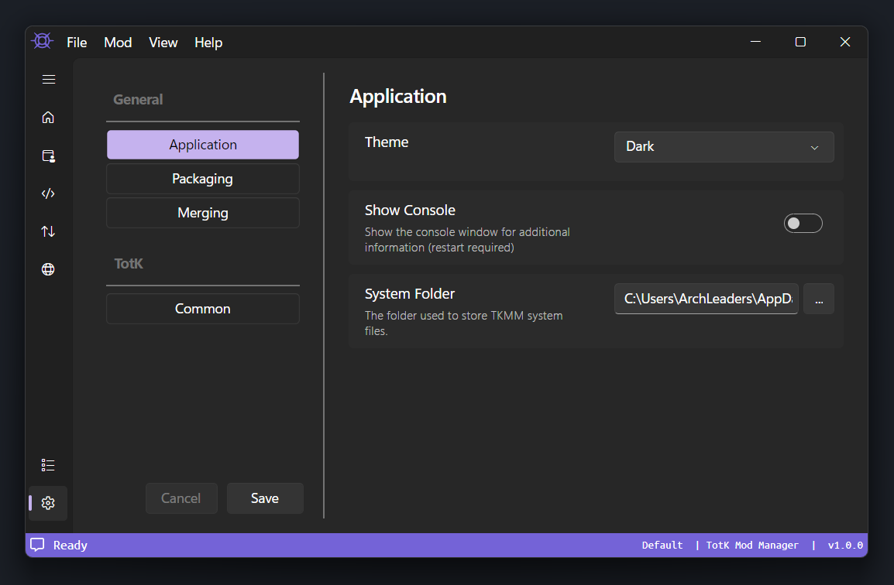
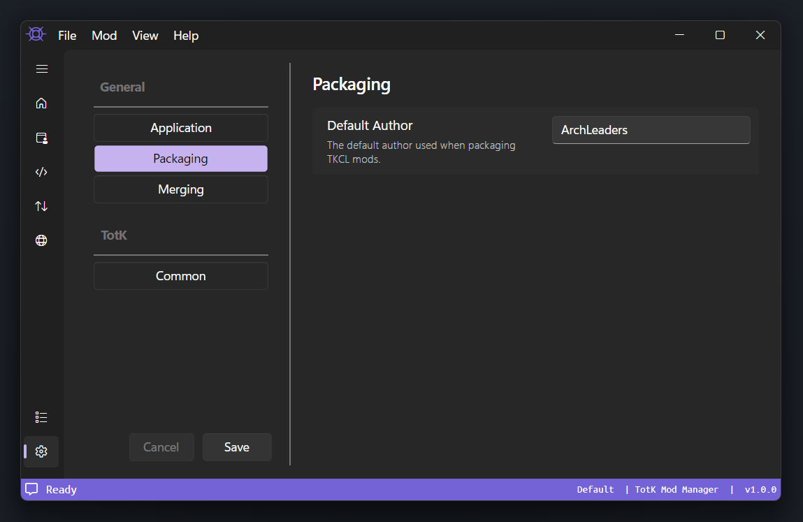
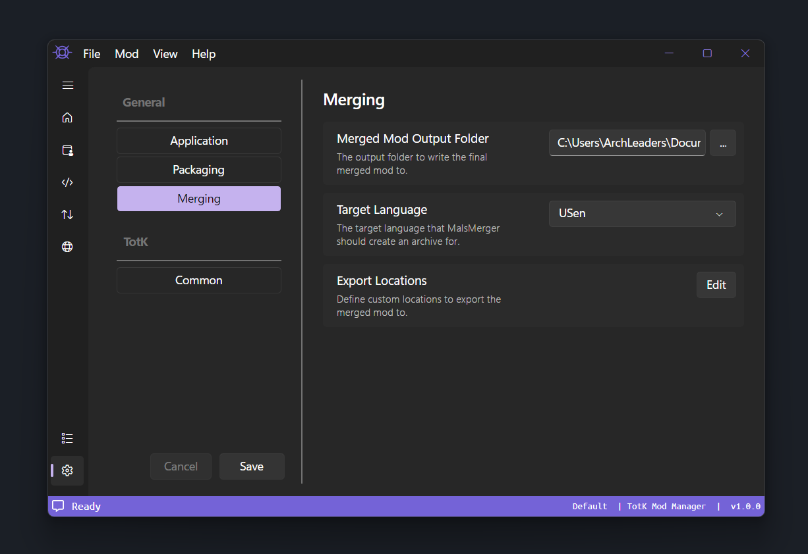

## Application Settings

    

---

### Theme

Controls the application theme. Options are `Dark` and `Light` (default is the system theme).

### Show Console

> \**Windows Only*

Controls whether or not the system console (command prompt) should remain open in the background.

This can be useful for debugging and reporting errors.

### Auto Save Settings

Controls whether or not changes made to TKMM's settings are automatically saved.

### System Folder

This is the folder where your mods and profiles are stored.

> [!NOTE]
> Unless you have low disk space on your system drive, it is recomended to leave this as the default.

### 7z Path

An optional field containing the path to the 7-zip executable. This speeds up extraction for mods installed via `.7z` files.

---

## Packaging Settings

    

---

### Default Author

Controls the default name to use when packaging new mods.

> [!IMPORTANT]
> By default this is your computers username. Make sure this does not contain sensitive information that may be packaged and deployed in mods.

---

## Merging Settings

    

---

### Merged Mod Output Folder

This is the folder where the merged export from TKMM is saved to.

> [!IMPORTANT]
> The contents of this folder will be deleted when merging, do not set it to a folder with any contents.
>
> If you are unsure, leave this setting as the default.

### Target Language

Controls the language to prefer when merging mods.

### Export Locations

A menu to configure additional custom export locations. By default, the default export locations for Japanese Citrus Fruit and Ryujinx are listed here and toggled off. You can add additional paths by clicking the `+` button. As with the `Merged Mod Output Folder`, the contents of this folder will be deleted when merging mods, so be sure to set these folders carefully. 