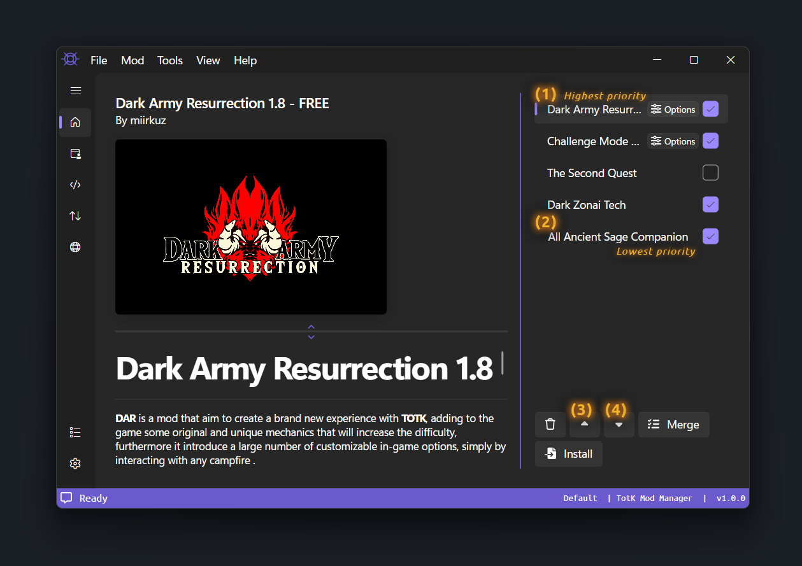
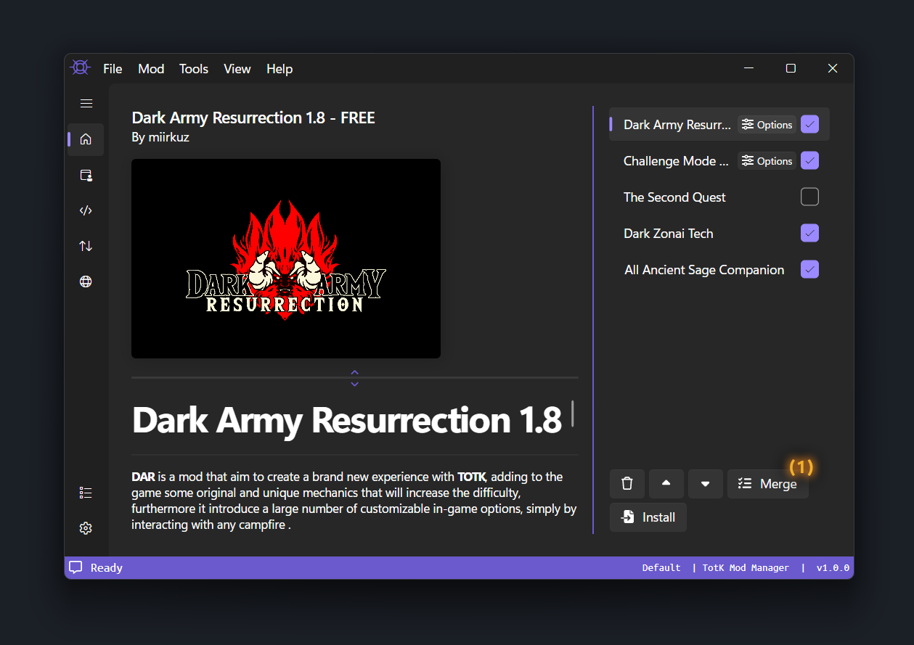
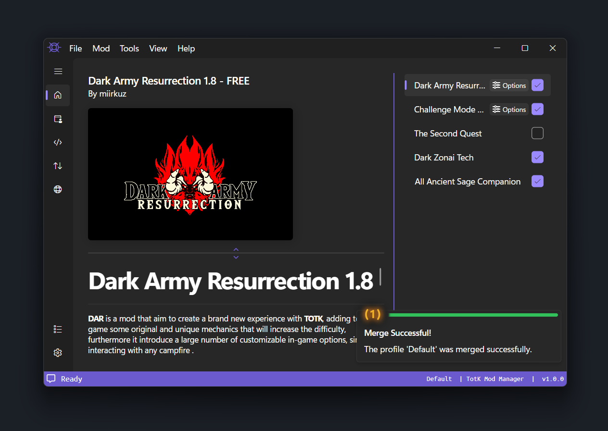
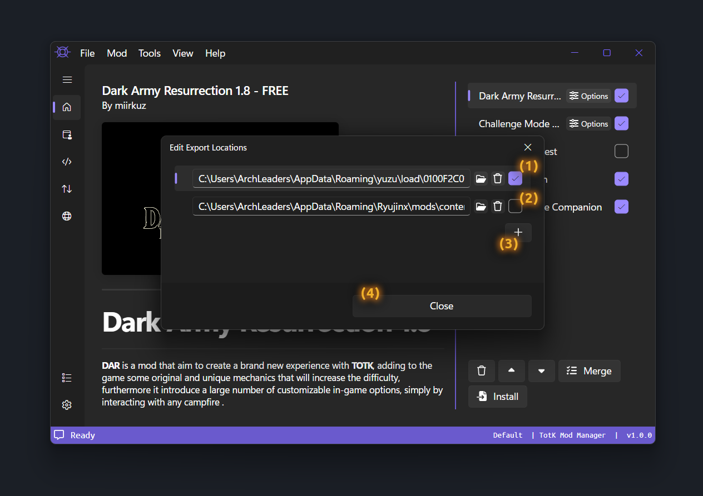
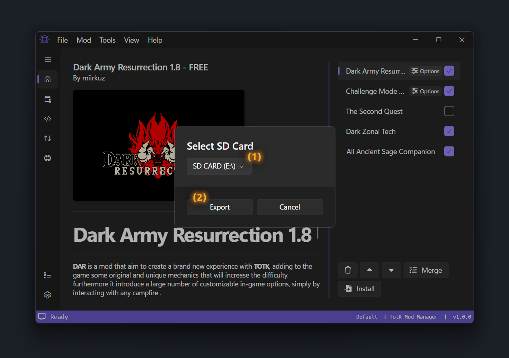

# Using Mods

This guide will go through installing mods, configuring mod options, and finally merging and exporting the merged mods.

## Installing Mods

To install a mod file, use <kbd><samp>Mod</samp></kbd> &gt; <kbd><samp>Install File</samp></kbd> or the <kbd><samp>Install</samp></kbd> button below the mod list.

The supported files formats are `.tkcl`, `.zip`, `.rar` and `.7z`.

> [!TIP]
> If you are installing `.7z` files, update your [Application Settings](../settings/#7z-path)' [7z Path](../settings/#application-settings) to make installation faster.

 

### Installing a Mod Folder

To install a mod folder, use <kbd><samp>Mod</samp></kbd> &gt; <kbd><samp>Install Folder</samp></kbd>.

Mod folders must contain a `romfs`, `exefs` or `cheats` folder.

 

### Installing a Mod from GameBanana

To install a mod from [GameBanana](https://gamebanana.com/totk), use <kbd><samp>Mod</samp></kbd> &gt; <kbd><samp>Install from Argument</samp></kbd> and provide the mod ID or URL.

Alternatively, you can use the built-in <a href="#installing-a-mod-from-the-gamebanana-browser" rel="nofollow">GameBanana browser</a> to browse and install mods.

 

### Installing a Mod from the GameBanana Browser

To open the built-in [GameBanana](https://gamebanana.com/totk) browser, click the <kbd><samp>GameBanana Mod Browser</samp></kbd> [(1)](./images/GameBananaPage.png) tab in the navigation bar.

    

To install a mod from the built-in [GameBanana](https://gamebanana.com/totk) browser, click the mod title [(2)](./images/GameBananaPage.png) and select a file in the dialog popup [(3)](./images/GameBananaPageInstallMod.png).

    

Once you have selected the file you wish to install, click <kbd><samp>Install</samp></kbd> [(4)](./images/GameBananaPageInstallMod.png) and wait for the installation to complete.

> [!NOTE]
> When possible, install the file that matches your game version.

 

## Configuring Mod Options

To configure options when installing a mod, click the prompt [(1)](./images/ConfigureOptionsPrompt.png) in the bottom right or the <kbd><samp>Options</samp></kbd> [(2)](./images/ConfigureOptionsPrompt.png) button.

    

> [!NOTE]
> If the mod has no options, there will **not** be a prompt and the <kbd><samp>Options</samp></kbd> button will not be visible.

Options are sorted into groups. Each group has a type to define how you pick the options.

* **Single** allows you to select `1` or `0` options.
* **Single Required** means you must select `1` option (the first option is always selected by default).
* **Multi** allows you to select any number of options (including `0`).
* **Multi Required** allows you to select any number of options but `1` must remain selected.

Click anywhere on the option group [(3)](./images/ConfigureOptions.png) to expand the available options [(4)](./images/ConfigureOptions.png).

    

Once the options are configured to your liking, press the <kbd><samp>Back Arrow</samp></kbd> [(5)](./images/ConfigureOptions.png) button in the top left to hide the options.

 

## Ordering Mods

Mods often contain files that TKMM cannot merge. To resolve this, TKMM retains the order of mods to overwrite mods with a lower priority.

The mod at the top of the list will have the highest priority [(1)](./images/ModListOrder.png), and the mod at the bottom of the list will have the lowest priority [(2)](./images/ModListOrder.png).

    

To change the order of mods, select one and use the up [(3)](./images/ModListOrder.png) and down [(4)](./images/ModListOrder.png) arrows to move the mod.

You can also move the mods by selecting and dragging them with your cursor.

    <video width="650" controls>
        <source src="./images/DragDropSnippet.mp4" type="video/mp4">
    </video>

The order of your mods is highly subjective. Larger mods are typically placed with lower priority, but you may have to tweak it to get everything working the way you want.

> [!TIP]
> If you are having issues with a certain mod, consult the mod author for guidance on placing it your mod list.

 

## Merging Mods

To merge your mods, press the <kbd><samp>Merge</samp></kbd> [(1)](./images/MergeMods.png) button or use the keyboard shortcut <kbd>Ctrl</kbd> + <kbd>M</kbd>.

If you wish to disable a mod, uncheck the checkbox on the mod. Press merge to apply your changes.

    

Merging may take some time, so be patient. When merging has completed a green banner [(1)](./images/MergeCompleted.png) will appear to notify you of completion.

    

- If you are playing on a **Switch emulator**, refer to the <a href="#emulator-setup" rel="nofollow">emulator setup</a> section.
- If you are playing on a **physical Switch**, refer to the <a href="#switch-setup" rel="nofollow">Switch setup</a> section.

 

### Emulator Setup

To setup exporting for one or more Switch emulators, use <kbd><samp>Mod</samp></kbd> &gt; <kbd><samp>Edit Export Locations</samp></kbd> or <kbd>Ctrl</kbd> + <kbd>L</kbd> to edit the export locations.

> [!NOTE]
> On the currently available version (**1.0.0-beta11**), this option is only accessible from the Settings page, under <kbd><samp>Merging</kbd></samp> > <kbd><samp>Export Locations</kbd></samp>. 

 

- If you are using **yuzu**, enable the **first** entry listed [(1)](./images/ExportLocations.png).
- If you are using **Ryujinx**, enable the **second** entry listed [(2)](./images/ExportLocations.png).

    

If you are using another emulator, click the <kbd><samp>+</samp></kbd> [(3)](./images/ExportLocations.png) button and paste the path to a <strong style="color:#c94646">TKMM subfolder</strong> in your emulator's mod folder.

Click <kbd><samp>Close</samp></kbd> [(4)](./images/ExportLocations.png) to save and close.

> [!TIP]
> You do not need to merge again after editing your export locations.

 

### Switch Setup

Before starting, insert your SD card into your computer or use the [Hekate USB Tools](https://switchway.net/transfer-files-via-usb/) (<kbd><samp>Tools</samp></kbd> &gt; <kbd><samp>USB Tools</samp></kbd> &gt; <kbd><samp>SD Card</samp></kbd> in Hekate) to transfer over USB.

Navigate to <kbd><samp>Tools</samp></kbd> &gt; <kbd><samp>Export to SD Card</samp></kbd> or use <kbd>Ctrl</kbd> + <kbd>E</kbd> to open the export dialog.

From there, select the SD card from the dropdown [(1)](./images/ExportForSwitch.png).

    

Finally, press <kbd><samp>Export</samp></kbd> [(2)](./images/ExportForSwitch.png) and wait for the export to complete.

> [!CAUTION]
> Mods previously installed in atmosphere will be **permanently deleted**. 
> Make sure `atmosphere/contents/0100F2C0115B6000` is empty before proceeding.
