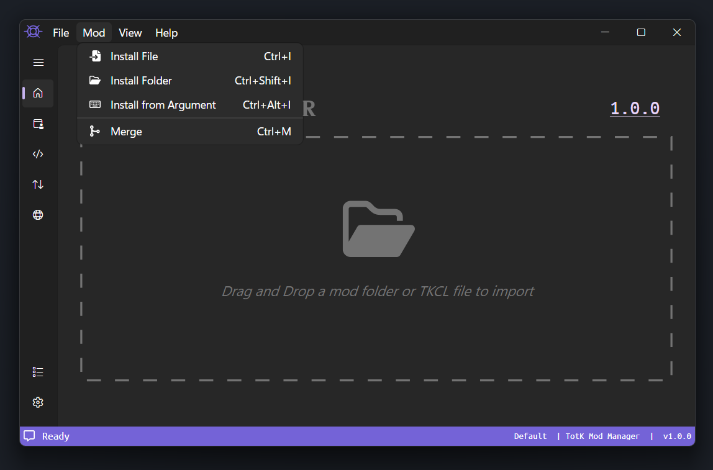
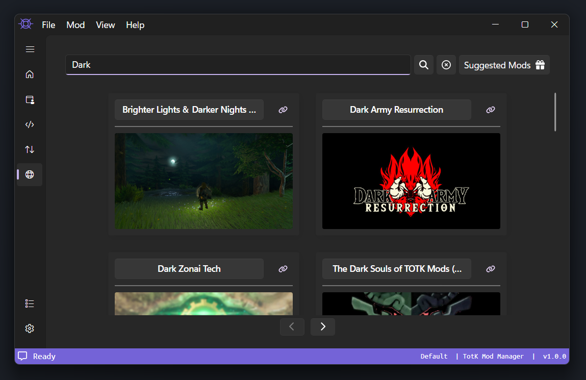
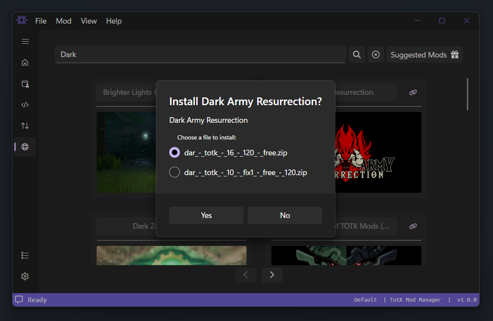
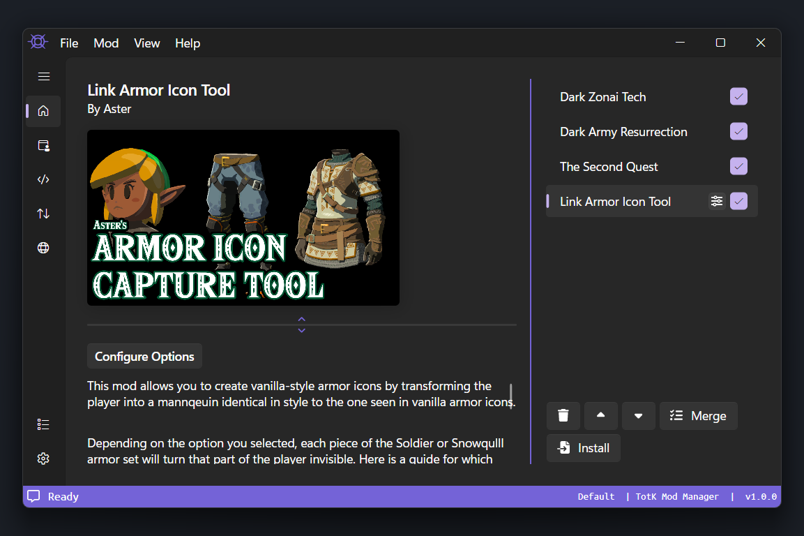
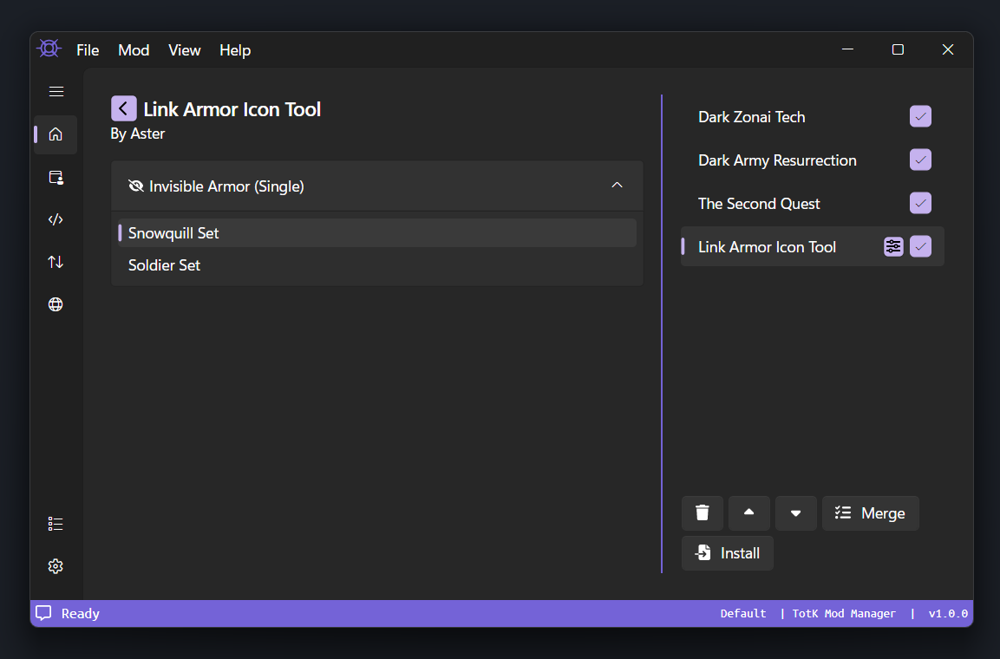
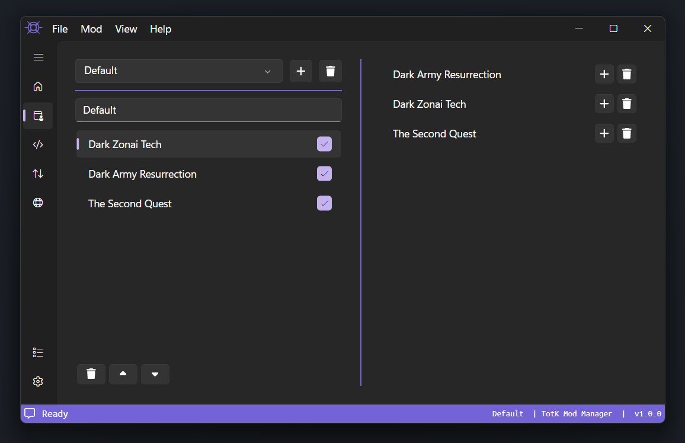
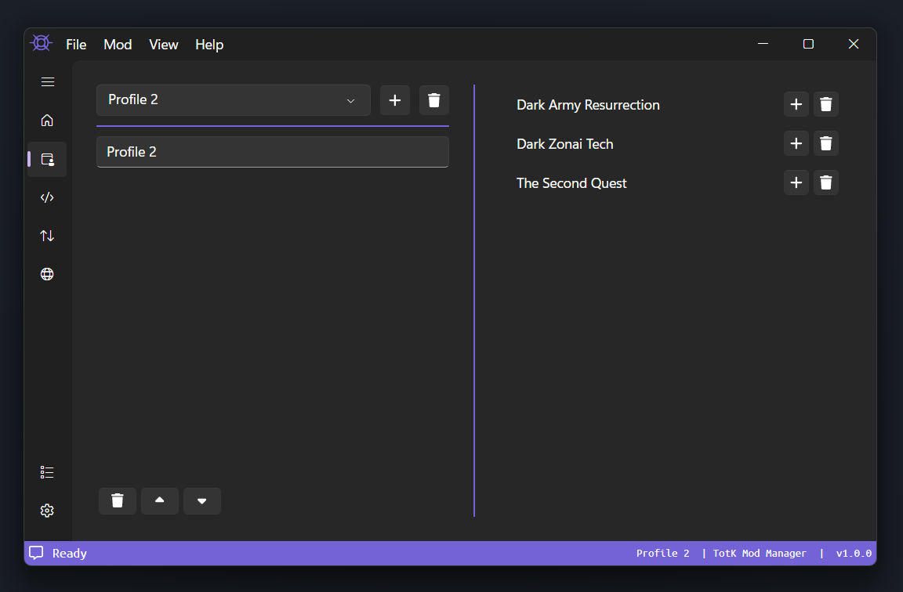
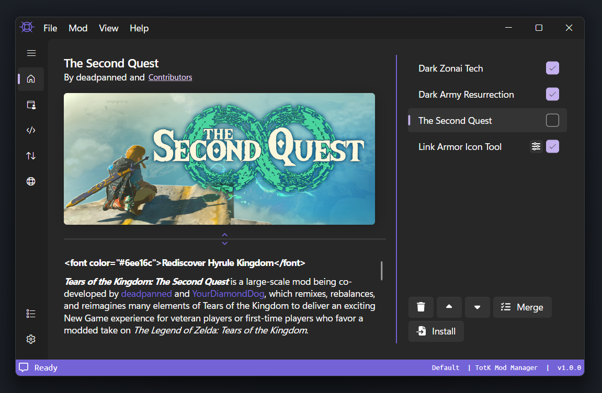
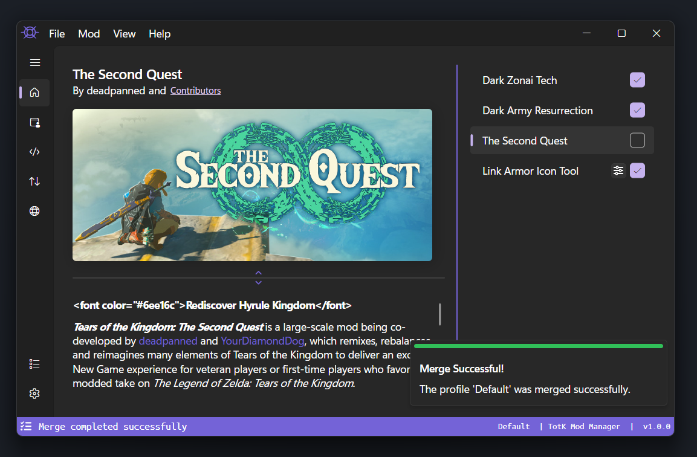
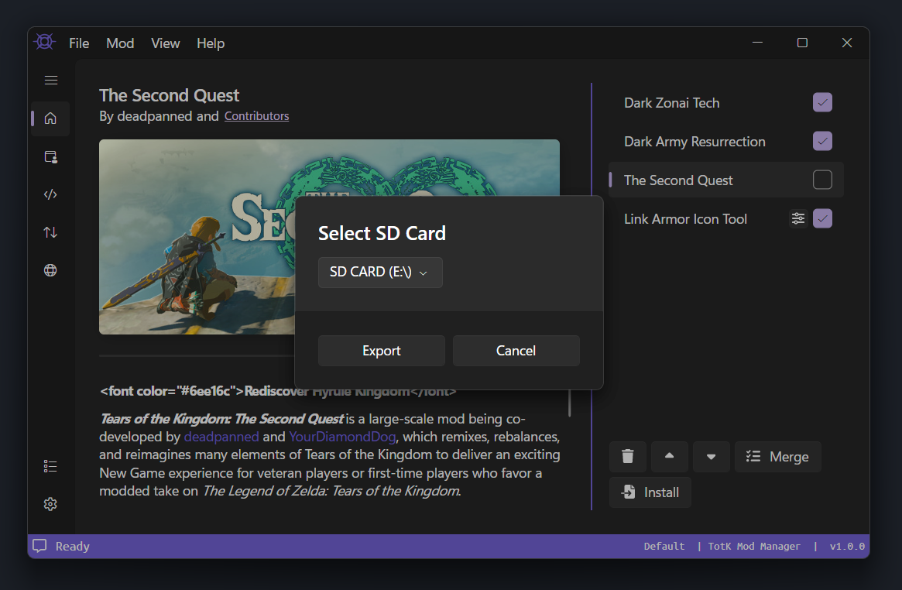

# Mods

This page will guide you on how to install mods, configure options for mods, and manage mod profiles.

## Installing Mods
You can install mods from a file archive, a folder, or from TKMM's built-in GameBanana tab.

### Installing Mods From An Archive
TKMM supports installing mods from several archive types, including `rar`, `zip`, `7z`, and a custom format, `TKCL`. The first three are generic archive types that you may already be familiar with from using mods. `TKCL` files are produced by developers using TKMM, and are the best option when available, since they were specifically designed for use in TKMM. To install a mod from a file, you can drag and drop the file onto the homepage of TKMM, or locate it in your computer's files by choosing `Install File` in the `Mod` dropdown at the top of the window. If your active profile already has at least one mod installed, you can click on the Install button at the bottom of the mod list. Additionally, the keyboard shortcut `Ctrl + I` will prompt you to select a file to install a mod from.

If you have a `TKCL` that you'd like to install, and you've associated TKCL files with TKMM on your device, you can simply double click it in your files to install it to TKMM. If you don't have an open TKMM window when you open a TKCL file associated with TKMM, a TKMM window will be automatically opened. If you want to associate `.tkcl` files with TKMM and installed TKMM using the launcher, the path to the executable is `%localappdata%\tkmm\bin\tkmm.exe` on Windows.

    

### Installing Mods From A Folder
TKMM supports installing a mod from a folder, provided it has the correct structure. The folder must only contain a romfs and/or exefs folder, and any files added using the packaging tab. To install a mod from a folder, you can drag and drop the folder onto the homepage of TKMM, or locate it in your computer's file system by choosing `Install Folder` in the `Mod` dropdown at the top of the window. Additionally, the keyboard shortcut `Ctrl + Shift + I` will prompt you to select a folder to install a mod from. This is the recommended method for mod developers who want to be able to quickly test their mod without having to package it.

### Installing Mods From TKMM's GameBanana Tab
TKMM is capable of browsing through GameBanana's Tears of the Kingdom page. To access it, click on the network icon in the left sidebar of TKMM. You will be presented with something resembling the below screen:

    

Mods are sorted by most recently submitted or updated. You can use the search bar at the top of the window to filter for mods by their title. Additionally, you can click on the Suggested Mods to see a curated list of mods by the TKMM development team. To install a mod, click on its name. You will be shown a list of the files submitted on that mod's page. Choose which one you'd like to install, then click "Yes", and TKMM will automatically package it and install it for you.

    

## Configuring Options
Mods packaged using TKMM can have Options to allow users to customize their experience with a specific mod. Option Groups are created by the mod developer when packaging a mod with TKMM, and they can be one of the following types: `Single`, `SingleRequired`, `Multiple`, and `MultipleRequired`. Both `Single` option group types only allow the user to choose a single option from the group. Both `Multiple` option group types allow the user to choose as many options from that group as they'd like. The `Required` option groups must have an option selected, and the groups that are not required do not have to be configured. For required groups, the first option in the group is selected by default.

To configure options for a given mod, click on the configuration icon to the right of the mod's name in the mod list. Alternatively, click the mod's name in the mod list, then click on the `Configure Options` button at the top of the description section, found underneath the mod's thumbnail.

    

After clicking on this, you will see all of the mod's Option Groups listed by name. Next to the name of the Option Group, the Option Group Type is listed. Simply expand the option group by clicking on it, and click to select options. You can click a selected option to deselect that option. When you are happy with your options, click on the back arrow in the top left of the window to return to the mod's main page.

    

## Managing Profiles

TKMM has a Profiles feature, which lets you manage different configurations of your installed mods. The profiles tab can be accessed with the icon below the Home icon. 

    

To create a new profile, press the `+` button near the top of the window. To name the profile, simply type in the text field below the profile selection dropdown. The new profile will be blank by default, so click on the `+` icon next to an installed mod's name on the right side of the screen to add it to the profile. To remove a mod from a profile, click on the mod on the left half the window, and click the trach icon in the bottom left corner. To completely uninstall a mod, click the trash icon next to the mod's name in the right half of the window. A mod can be removed from a profile without being uninstalled, but uninstalling a mod will remove it from all profiles.

    

## Merging Mods
In the mods list, on the right side of each mod's name, there is a checkbox. If the box is checked, that means the mod is enabled, and will be included in the merged export. If the box is unchecked, the mod is disabled, and it will not be included in the merged export. You can click and drag mods around to change their priority relative to one another. Mod's higher on the list will be given greater priority. For example, if two enabled mods each edit the same .bfres file, the mod with higher priority will have its changes applied, since bfres files don't support changelogs. When you are happy with your enabled mods and their priority, click `Merge` at the bottom of the screen. Your mods will be automatically merged and exported to the Merged Mod Output Folder specified in the settings.

    

 Once your mods are successfully exported, you'll see this banner appear in the bottom right of TKMM as shown below, no matter which tab you are on. To ensure you don't miss it, it will not go away until you click on it. If you instead see a banner with a reddish pink line at the top, then your mods have failed to merge. Please reach out on the [TKMM Discord Server](https://discord.gg/BbVXenRFVc) for support.

    

## Export to Switch (SD Card)

For Switch users, `Export to an SD Card` is the best way to get your merged mods to your switch.

    

To use this feature, first make sure you have your SD card plugged in.

Then navigate to `File` > `Export to SD Card`. This will open up a dialog where you can choose your SD Card.

    

After choosing the correct SD card from the dropdown, simply click `Export` and wait for the merge to complete.

> [!WARNING]
> Any existing `romfs` or `exefs` folders will be permanently deleted from `atmosphere/contents/0100F2C0115B6000`.
>
> Make sure there is nothing you wish to keep in those folders.