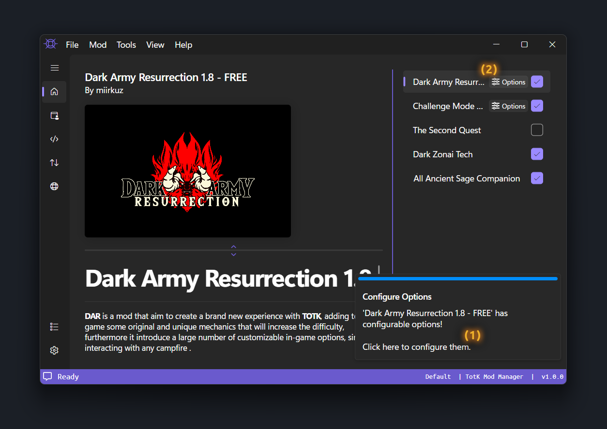

# Using Mods

This guide will go through installing mods, configuring mod options, and finally merging and exporting the merged mods.

## Installing Mods

To install a mod file, use <kbd><samp>Mod</samp></kbd> &gt; <kbd><samp>Install File</samp></kbd> or the <kbd><samp>Install</samp></kbd> button below the mod list.

The supported files formats are `.tkcl`, `.zip`, `.rar` and `.7z`.

> [!TIP]
> If you are installing `.7z` files, update your [Application Settings](/404)' [7z Path](/404) to make installation faster.

 

### Installing a Mod Folder

To install a mod folder, use <kbd><samp>Mod</samp></kbd> &gt; <kbd><samp>Install Folder</samp></kbd>.

Mod folders must contain a `romfs`, `exefs` or `cheats` folder.

 

### Installing a Mod from GameBanana

To install a mod from [GameBanana](https://gamebanana.com/totk), use <kbd><samp>Mod</samp></kbd> &gt; <kbd><samp>Install from Argument</samp></kbd> and provide the mod ID or URL.

Alternatively, you can use the built-in [GameBanana browser](#installing-a-mod-from-the-gamebanana-browser) to browse and install mods.

 

### Installing a Mod from the GameBanana Browser

To open the built-in [GameBanana](https://gamebanana.com/totk) browser, click the <kbd><samp>GameBanana Mod Browser</samp></kbd> [(1)](./images/GameBananaPage.png) tab in the navigation bar.

    

To install a mod from the built-in [GameBanana](https://gamebanana.com/totk) browser, click the mod title [(2)](./images/GameBananaPage.png) and select a file in the dialog popup [(3)](./images/GameBananaPageInstallMod.png).

Once you have selected the file you wish to install, click <kbd><samp>Install</samp></kbd> [(4)](./images/GameBananaPageInstallMod.png) and wait for the installation to complete.

> [!NOTE]
> When possible, install the file that matches your game version.

    

 

## Configuring Mod Options

To configure options when installing a mod, click the prompt [(1)](./images/ConfigureOptionsPrompt.png) in the bottom right or the <kbd><samp>Configure Options</samp></kbd> [(2)](./images/ConfigureOptionsPrompt.png) button below the thumbnail.

    

> [!NOTE]
> If the mod has no options, there will **not** be a prompt and the <kbd><samp>Configure Options</samp></kbd> button will not be visible.

Options are sorted into groups. Each group has a type to define how you pick the options.

* **Single** allows you to select `1` or `0` options.
* **Single Required** means you must select `1` option (the first option is always selected by default).
* **Multi** allows you to select any number of options (including `0`).
* **Multi Required** allows you to select any number of options but `1` must remain selected.

Click anywhere on the option group [(3)](./images/ConfigureOptions.png) to expand the availible options [(4)](./images/ConfigureOptions.png).

    

Once the options are configured to your liking, press the <kbd><samp>Back Arrow</samp></kbd> [(5)](./images/ConfigureOptions.png) button in the top left to hide the options.

 

## Ordering Mods

The mod list can be rearranged, this allows you to choose the priority order of each mods. Sometimes, some files and edits will be priority based, therefore some conflicting elements from several mods may overwrite each other.

The mod at the top of the list will have the highest priority, and the mod at the bottom of the list will have the lowest priority.

There are 2 ways of rearranging the order. You can either select a mod and use the arrow buttons under the mod list, or you can drag and drop a mod in the list with your mouse.

When choosing the order of your mods, you will usually want to place the biggest mods with the highest amount of changes on the lowest priority (this may not apply to all cases, some combinations may need to be tested individually).

 

## Merging Mods
In the mods list, on the right side of each mod's name, there is a checkbox. If the box is checked, that means the mod is enabled, and will be included in the merged export. If the box is unchecked, the mod is disabled, and it will not be included in the merged export. You can click and drag mods around to change their priority relative to one another. Mod's higher on the list will be given greater priority. For example, if two enabled mods each edit the same .bfres file, the mod with higher priority will have its changes applied, since bfres files don't support changelogs. When you are happy with your enabled mods and their priority, click `Merge` at the bottom of the screen. Your mods will be automatically merged and exported to the Merged Mod Output Folder specified in the settings.

    

 Once your mods are successfully exported, you'll see this banner appear in the bottom right of TKMM as shown below, no matter which tab you are on. To ensure you don't miss it, it will not go away until you click on it. If you instead see a banner with a reddish pink line at the top, then your mods have failed to merge. Please reach out on the [TKMM Discord Server](https://discord.gg/BbVXenRFVc) for support.

    

## Export to Switch (SD Card)

For Switch users, `Export to an SD Card` is the best way to get your merged mods to your switch.

    

To use this feature, first make sure you have your SD card plugged in. It is recommended to use the USB Tool available in Hekate to avoid  constantly needing to remove the SD card from its slot.

Then navigate to `File` > `Export to SD Card`. This will open up a dialog where you can choose your SD Card.

    

After choosing the correct SD card from the dropdown, simply click `Export` and wait for the operation to complete.

> [!WARNING]
> Any existing `romfs` or `exefs` folders will be permanently deleted from `atmosphere/contents/0100F2C0115B6000`.
>
> Make sure there is nothing you wish to keep in those folders.