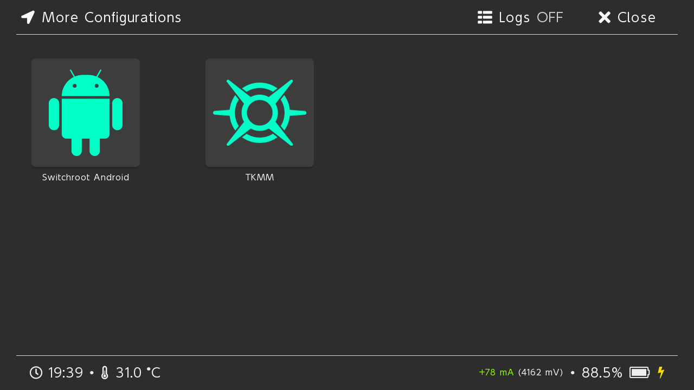
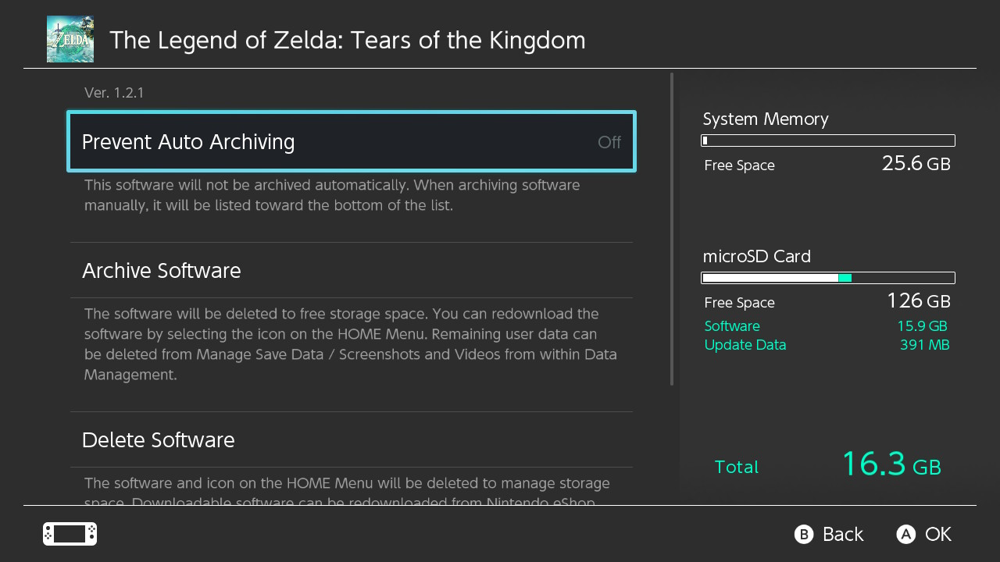

# Thank You for Downloading TKMM

If you are new to Switch modding, refer to the [Switch hacks](https://switch.hacks.guide/) guide to get started.

---

To install TKMM on your Nintendo Switch, simply extract the contents of the downloaded zip file at the root of your SD card.

Once that is done, you will find a new boot entry for TKMM under `Other Configs` in Hekate.

    

Please make sure that your keys are dumped with `Lockpick_RCM` and that both the base game and update are installed on your micro SD card (as shown on the capture below).

Otherwise, if it is installed on the internal storage, or your base game is a cartridge, you will need to dump it with nxdumptool (split files also work).

    

