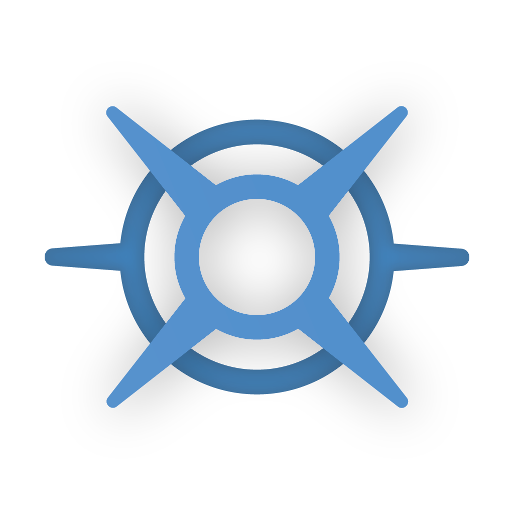

  
  <h1 id="main-title">Tears of the Kingdom Mod Manager</h1>

   &nbsp;
   &nbsp;
  

**TKMM**, an acronym for **T**ears of the **K**ingdom **M**od **M**anager, is a versatile tool crafted to streamline modding across multiple platforms for the game *Tears Of The Kingdom*. **TKMM** utilizes various mod merging tools, delivering a quick and satisfying experience for modders, and end users alike.

   &nbsp;
   &nbsp;
  

## Mod Merging

TKMM integrates with multiple mod merging tools to support the seamless combination of various file types.

### Current Supported File Types

* **ResourceSizeTable**:
  - Initially enhanced by [LordBubbles](https://github.com/MasterBubbles) based on [dt12345](https://github.com/dt12345)'s original restbl tool for efficiency and convenience.
  - Later rewritten by [Arch Leaders](https://github.com/ArchLeaders) specifically for performance enhancements.

* **RSDB** *(Tag.Product, PouchActorInfo, GameActorInfo, etc.)*:
  - Originated from [Legend5v](https://gamebanana.com/members/2731522)'s foundational code. 
  - The [RSDB merger](https://github.com/MasterBubbles/rsdb-merge) by [Lord Bubbles](https://github.com/MasterBubbles) is user-friendly and efficient.
  - Subsequently redeveloped by [Mika](https://github.com/okmika) to enhance its capabilities and integration.

* **Localization (Mals)**:
  - Developed by [Arch Leaders](https://github.com/ArchLeaders). The [MalsMerger](https://github.com/ArchLeaders/MalsMerger), utilizing the new BYML library, is renowned for its speed and efficiency.

* **SARC Archives (.pack)**:
  - Crafted by [Mika](https://github.com/okmika). The [SARC and BYML Merger](https://github.com/okmika/TKMM-SARC) employs Arch Leaders' BYML library for improved performance and accuracy.

* **BYML Files (.byml, .bgyml)**:
  - Development and support provided exclusively by [Mika](https://github.com/okmika) and [Arch Leaders](https://github.com/ArchLeaders), utilizing the latter's BYML library.

* **ShopParam Exceptions**:
  - A collaborative effort by [Mika](https://github.com/okmika), [Bubbles](https://github.com/MasterBubbles), and [5th](https://github.com/The5thTear). The ShopParam handler ensures error prevention in shop entries, maintaining mod integrity.

## Contributions and Special Thanks
  
* **Arch Leaders**:
  - Key Developer in UI Support, Development, and Tool Development.
  - Instrumental in laying the foundational framework for the User Interface.
  - Developed and integrated critical components, including a new BYML library.
  - Creator of the MalsMerger tool, enhancing project efficiency.
  - Consistently reliable in assuming additional responsibilities and addressing project needs.
  - Known for a genuine and positive contribution to the team dynamic.

* **The5thTear**:
  - Lead Developer and UI Programmer.
  - Authored comprehensive documentation for the project.
  - Played a crucial role in taking in community input, and using that input to guide and collaborate with Arch Leaders to achieve excellence in development.
  - Embraced the project as a significant learning opportunity.
  - Actively involved in project development, often seeking and providing collaborative support.

* **Lord Bubbles**:
  - Developed the second rendition of the RSDB Merger and RSTB Calculator.
  - Instrumental in rewriting existing tools and developing new ones.
  - Provided valuable feedback and innovative solutions.
  - Played a key role in resolving complex issues, notably the shopparam system.
  - Known for a charismatic and humorous personality, enhancing team morale and collaboration.

* **Mika**:
  - Developer of the expansive SARC merger, incorporating the BYML merger.
  - Enhanced the merger with two critical submodules:
    - The RSDB module, known for its complexity and pivotal role in development.
    - The GDL merger, a challenging and intricate addition to the project.
  - Recognized for exceptional speed and efficiency in development.

* **Aster**:
  - Came up with the original idea for the project.
  - Expert in Graphic Design, responsible for creating the project's visual elements.
  - Actively manages donation platforms, contributing to the project's sustainability.
  - Provides insightful feedback, enhancing the project's development.
  - Skilled in offering constructive criticism, aiding in continuous improvement and growth.

* **Tom** (GameBanana Staff):
  - Key player in enabling One-Click Install Support for the project.
  - A major figure at GameBanana, the platform hosting TKMM.
  - Instrumental in integrating and streamlining mod support for the mod manager.

* **dt12345**:
  - Actively contributed through detailed feedback.
  - Managed the TotK script repository, aiding in the developers understanding and ease of access for specific formats.

* **Legend5v**:
  - Provided the original code for the RSDB-Merger.
  - Although unfinished, this code laid the groundwork for further development.

* **Watertoon**:
  - Documented BYML structures.
  - Their documentation has been essential for the creation of the BYML library.

* **Echocolat**:
  - Offered valuable feedback on the Mod Options system.
  - Provided general support, boosted the Discord server.

## Moderators and Beta Testers

* **Alciel**:
  - Responsible for Moderation.
  - Actively involved in Beta Testing.

* **Godzilla4**:
  - Played a key role in Moderation.
  - Contributed significantly to Beta Testing.

* **mr.the**:
  - Focused on Beta Testing.
  - Provided valuable Feedback throughout the testing phase.

## Supporters

* **xPretorianx**:
  - Acknowledged as an enthusiastic and active Supporter of the project.
  - Has been a significant source of motivation for the team.

* **vintii**:
  - Made a significant donation, greatly supporting the team financially.
  - Recognized for their active and ongoing involvement in the project.

* **Mindstormman**:
  - Distinguished as the project's first Supporter, setting a foundation for future support.

* **Rennai**:
  - Promoted the project on a large TOTK Modding Hub Server.
  

  

*Join our Discord community [here](https://discord.com/invite/3tNUBWQRXv) if you'd like to contribute to the development of **TKMM**. Your insights and collaboration are highly valued!*
