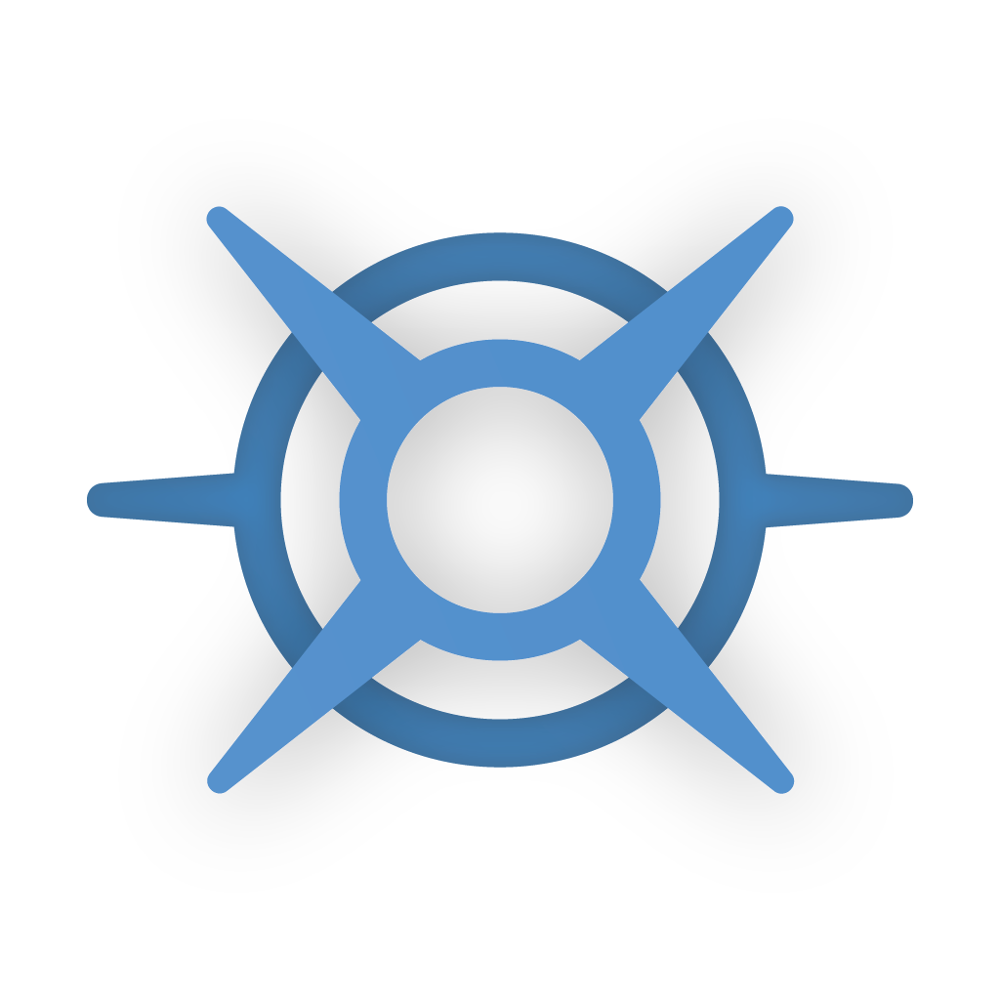

  
  <h1 id="main-title">Tears of the Kingdom Mod Manager</h1>

   &nbsp;
   &nbsp;
  

---

  <a class="download-btn" id="download-main" href="./downloads">Download TKMM</a>

 

TKMM, or Tears of the Kingdom Mod Manager, is a mod merger and manager for TotK (yes, we have a very creative name).

Unlike other mod managers for TotK, TKMM merges the individual mod files to ensure the best possible compatibility with
every mod available.

TKMM is currently available on desktop (Windows, Linux and macOS) and Switch.

Check out the [getting started](./docs) page to download and use TKMM!

---

If you wish to show your support for the project, please leave a star on
the [GitHub repository](https://github.com/TKMM-Team/Tkmm).

   &nbsp;
   &nbsp;
   &nbsp;
  

*Join our [Discord community](https://discord.com/invite/3tNUBWQRXv) for news and updates!*
