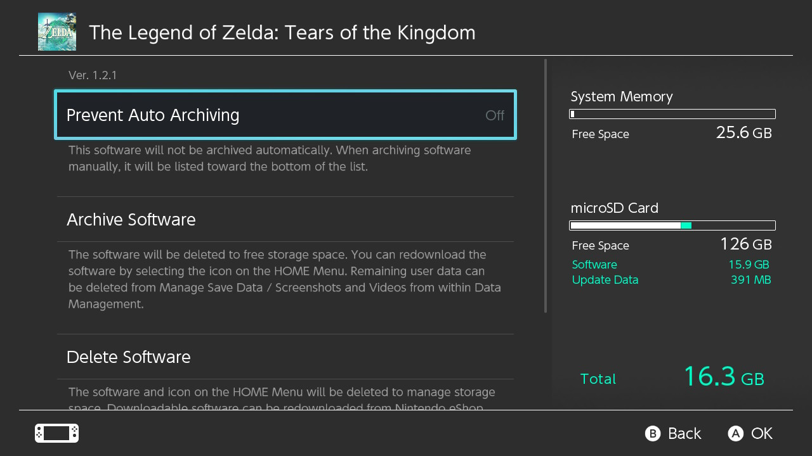
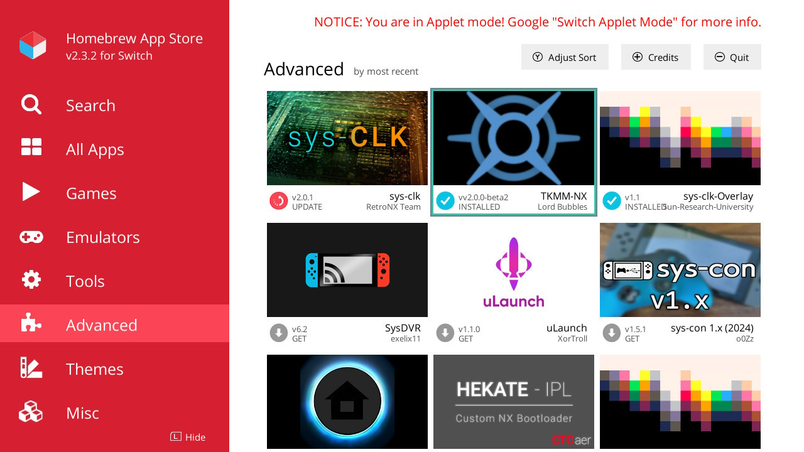
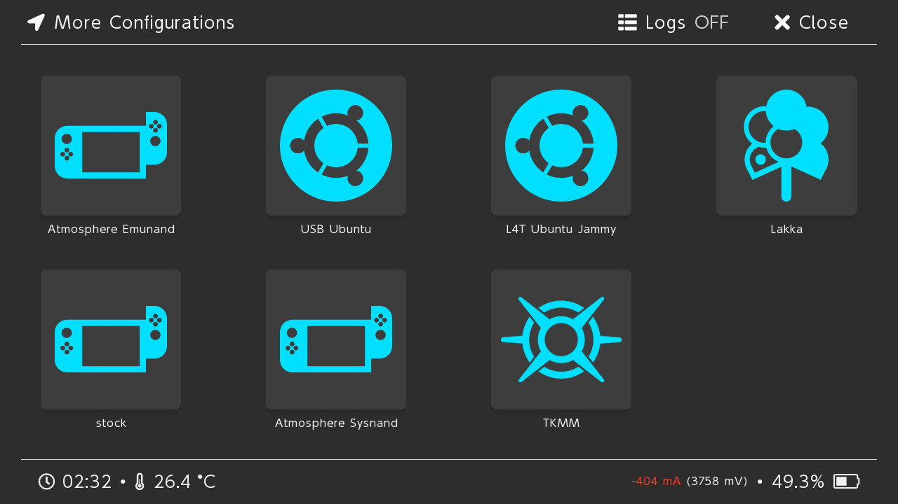
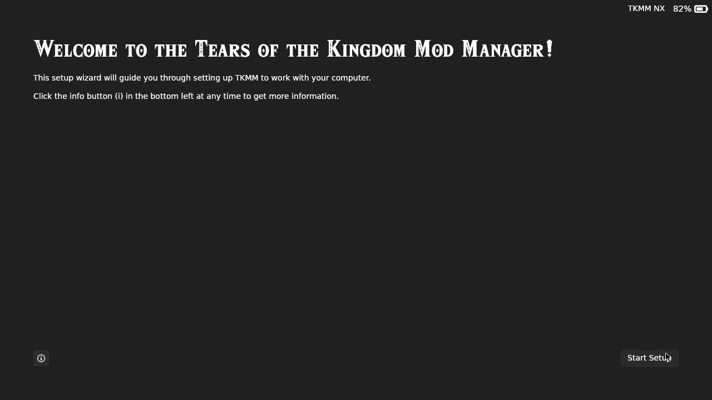
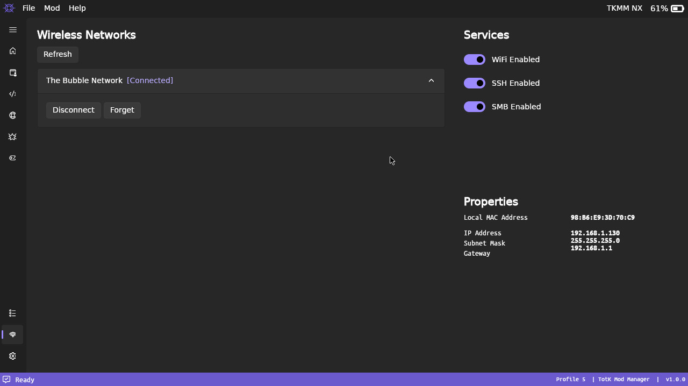
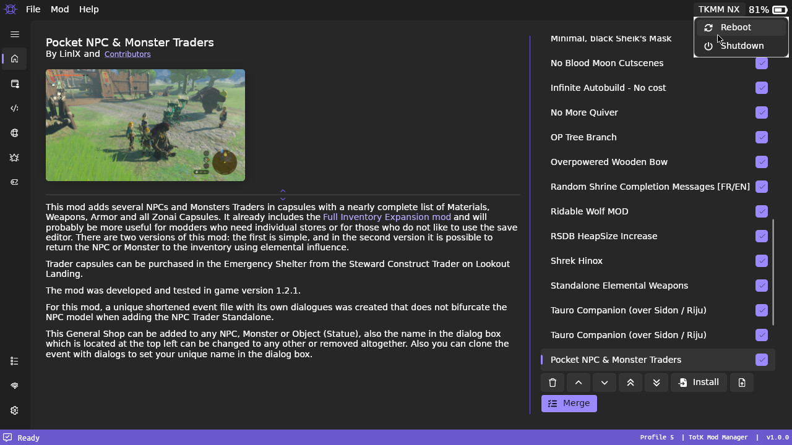
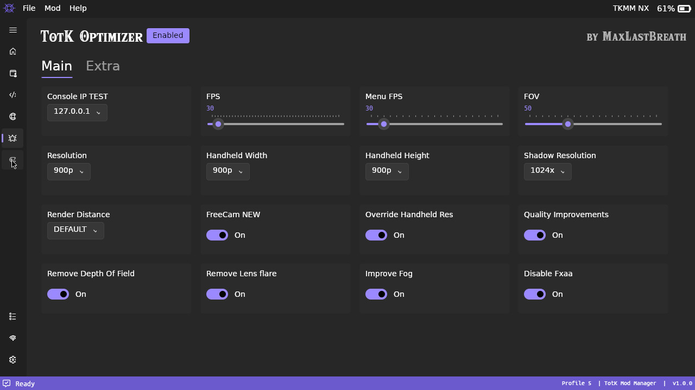

# TKMM on the Switch

    
     

 

## Prerequisites

1. Tears of the Kingdom base game and update ([1.1.0 or later](../faq/#why-cant-i-use-version-100)) either installed on your SD card or dumped with [nxdumptool](https://github.com/DarkMatterCore/nxdumptool/releases) (as an XCI or NSP file).
2. [Lockpick_RCM](https://github.com/impeeza/Lockpick_RCMDecScots/releases/latest/download/Lockpick_RCM_Hekate.zip) (For dumping your keys)
3. [nxdumptool](https://github.com/DarkMatterCore/nxdumptool/releases) (Only required if your game/update is a cartridge, or installed to internal memory)
4. [HEKATE](https://github.com/CTCaer/hekate/releases/latest) (Download the `hekate_ctcaer_(version).zip` release of hekate)

 

## Preparation

### 1. SD Card Setup 

To install TKMM-NX, 

- Download [`tkmm-nx.zip`](https://github.com/TKMM-Team/TKMM-NX/releases/latest/download/tkmm-nx.zip) and extract it to the root of the SD card (or install it later from the Homebrew app).
- Extract `hekate_ctcaer_(version).zip` and `Lockpick_RCM_Hekate.zip` to the root of the SD card (replace existing files if prompted).
- If needed, install [nxdumptool](https://github.com/DarkMatterCore/nxdumptool/releases) by copying `nxdt_rw_poc.nro` to the `/switch` folder in the root of the SD card. (See [Ensure TotK is Accessible](#2-ensure-tears-of-the-kingdom-is-accessible) to determine if you need this.)

 

### 2. Ensure Tears of the Kingdom is Accessible

TKMM-NX needs access to the base game and update data (version `1.1.0` or later) in order to function, as well as the Switch's keys to decrypt them.

To determine where the base game and update data are installed, refer to `Data Management` > `Manage Software` > `Tears of the Kingdom` in the Switch's settings.

    

If both `Software` and `Update Data` are listed under `microSD Card`, you do not need to dump your game, and all that is required is [dumping the Switch's keys](#3-dumping-keys).

Otherwise, only parts **not installed** on the `microSD Card` need to be dumped. Refer to [Dumping Tears of the Kingdom](#4-dumping-tears-of-the-kingdom) for more information.

 

### 3. Dumping Keys

To dump the Switch's keys, open the Payloads option in HEKATE and launch `Lockpick_RCM.bin`, then select `Dump from SysNAND`. (Use the power button to select and volume up/down to navigate.)

 

### 4. Dumping Tears of the Kingdom

Begin by running nxdumptool (`nxdt_rw_poc`) from the Homebrew Launcher.

 

#### Base Game

- If the base game is a **cartridge**, insert the cartridge, then navigate to `gamecard menu` / `dump gamecard image (xci)` and select `start xci dump`.
- If the base game is **installed to system memory**, open the `user titles menu`, select <ins>Tears of the Kingdom</ins>, navigate to `nsp dump options` > `dump base application` and finally select `start nsp dump`. (It is also possible to re-download the game from the e-shop, which will install it on the SD card and save space in the system memory. If this is done, be sure to run the game at least once, and [dump the keys](#3-dumping-keys) again.)

 

#### Update

- If the base game is installed to system memory, open the `user titles menu`, select <ins>Tears of the Kingdom</ins>, navigate to `nsp dump options` > `dump update` and finally select `start nsp dump`. (It is also possible to re-download the game from the e-shop, which will install it on the SD card and save space in the system memory. If this is done, be sure to run the game at least once, and [dump the keys](#3-dumping-keys) again.)

 

Join the [nxdumptool Discord server](https://discord.gg/SCbbcQx) for assistance on how to dump if needed.

> [!TIP]
> TKMM can handle split files; combining them after dumping is not required.

 

## Installation

### Installing from the Homebrew App Store

If TKMM-NX was not installed in the [preparation](#preparation) section by extracting it to the SD card, it can be installed from the Homebrew App Store (under the advanced category).

    

 

### Post-Installation Setup

If TKMM-NX is installed correctly, a boot entry for `TKMM` will appear under `More Configs` in HEKATE.

    

The first time TKMM-NX is opened, the setup wizard will appear. If the [preparation](#preparation) section was done correctly, no additional setup will be required.

If the setup wizard cannot find the keys or the game/update, review the steps in the [preparation](#preparation) section.

    

 

#### Network Setup (Optional)

To enable the GameBanana mod browser and other network features, TKMM-NX must be connected to the internet.

To connect to a wireless network, navigate to the network page (Wi-Fi icon on the bottom left) and select `Connect` on a wireless network. Enter the password if needed, and wait for the status to change to `Connected`.

    

> [!NOTE]
> If network features aren't working, ensure that `WiFi Enabled` is toggled `ON` under `Services`.

 

## Using TKMM-NX

### Installing Mods

Mods can be installed from either the built-in GameBanana browser or by selecting files on your SD card.

Refer to the [Using Mods](../docs/using-mods/) page for more information on how to install mods with TKMM.

> [!IMPORTANT]
> After making any changes to the mod list, you must click `Apply` on the home page for changes to take effect.

 

### Leaving TKMM-NX

To reboot to HEKATE, select `Reboot` from the `TKMM-NX` menu at the top right.

    

For convenience, it is also possible to press the `Home button` to show a pop-up allowing you to reboot or shut down.

 

### Additional Information

- Pressing the `Capture button` will create a screenshot in the `tkmm/screenshots` folder on the SD card.
- If required for diagnosing an issue, the logs are located in `tkmm/storage/.tkmm/Logs` on the SD card.

For more detailed help on how to use TKMM, please refer to the [documentation](https://tkmm.org/docs), or join the [TKMM Discord server](https://tkmm.org/discord).

 

## Integrated TotK Optimizer / Ultracam

[MaxLastBreath](), the developer of the TotK Optimizer ([Ultracam](https://gamebanana.com/mods/480138)), has allowed the TKMM Team to use his mod and directly integrate it into TKMM.

It can be enabled from the `TotK Optimizer` page on the left (star icon). Keep in mind, the Switch may not be able to boot the game if you select any resolution higher than 1080p and 60 FPS.

> [!NOTE]
> You do not need to install [Ultracam](https://gamebanana.com/mods/480138) separately, as it is already integrated into the TotK Optimizer page. For users with access to the beta versions, install the TKCL file provided on the official [NX Optimizer Discord Server](https://www.nxoptimizer.com/discord). (See [Using Mods](../docs/using-mods#installing-mods) for installing TKCL files.)

    

For more information, visit the [official website](https://www.nxoptimizer.com/games/tears-of-the-kingdom/) of the optimizer and get a better idea of what this mod is and how best to configure it for your Switch.

All assistance requests related to the optimizer should be directed to the [Discord server for the optimizer](https://www.nxoptimizer.com/discord).

---

*This guide is based on the original Game Banana tutorial by [lordbubbles](https://ko-fi.com/lordbubbles), consider supporting him on [KoFi](https://ko-fi.com/lordbubbles).*

    
     

