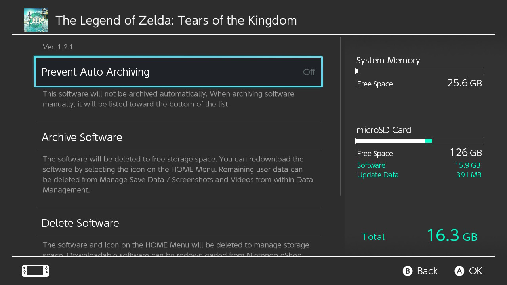
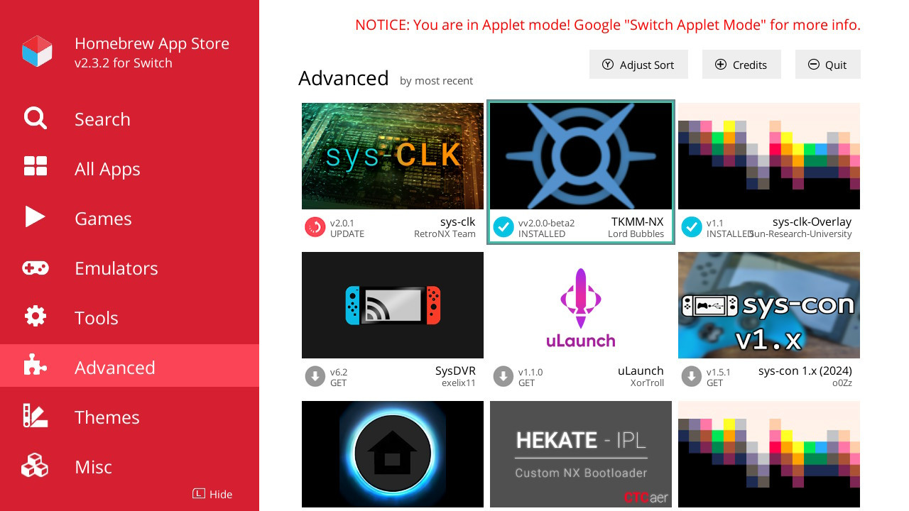
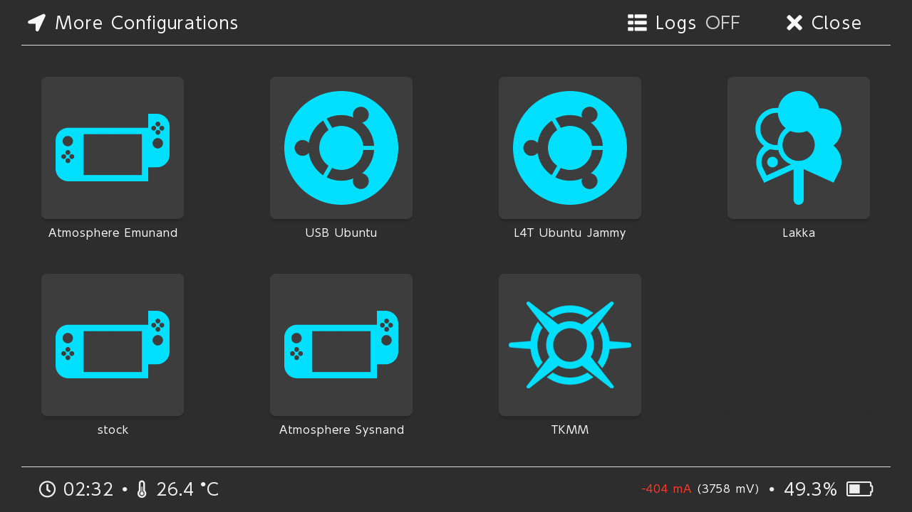
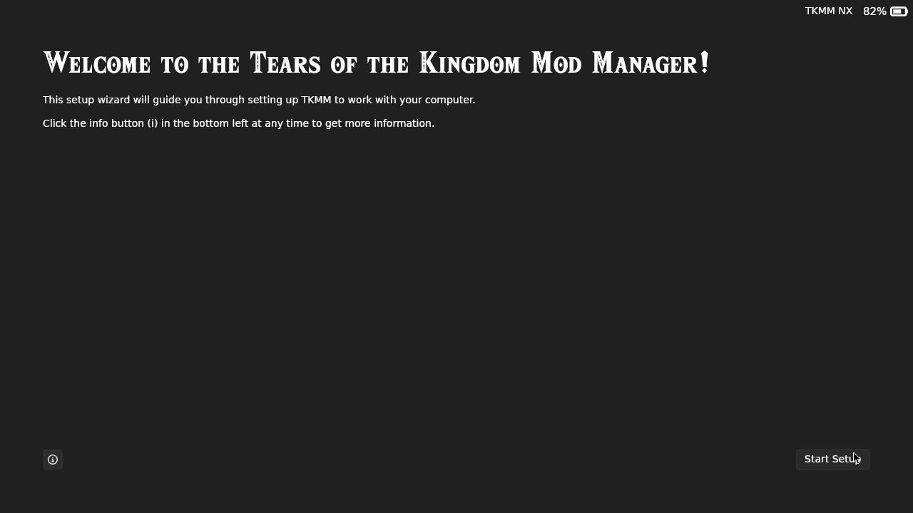
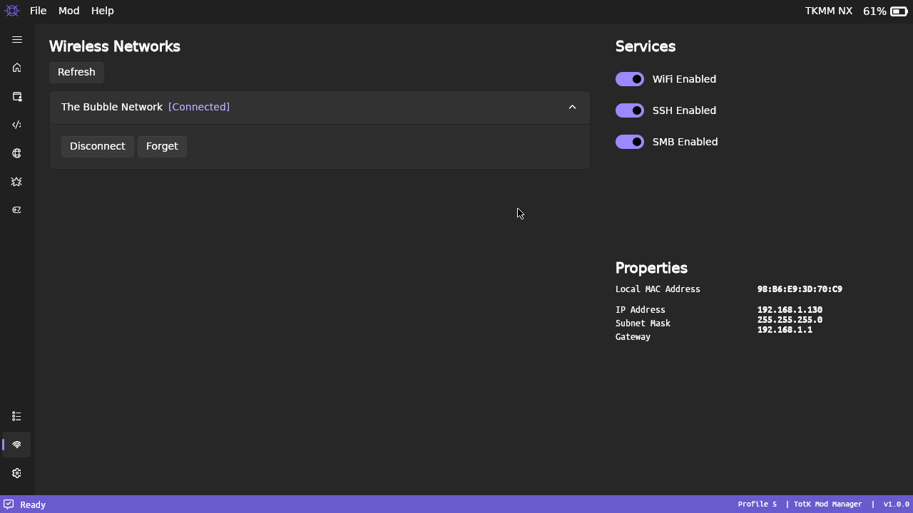
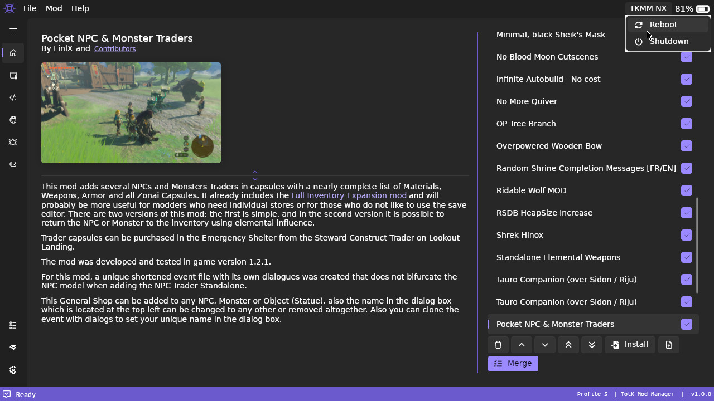
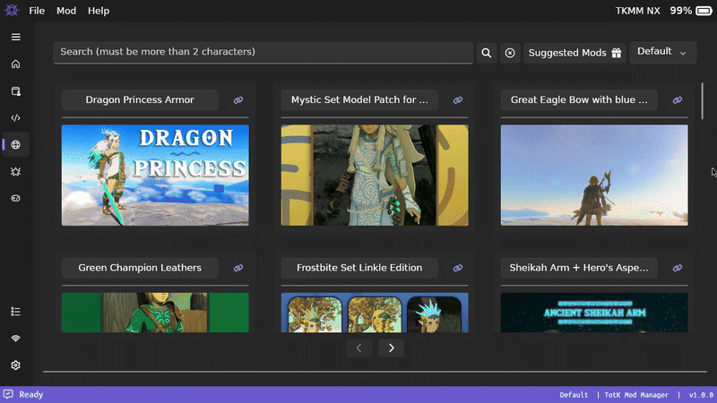
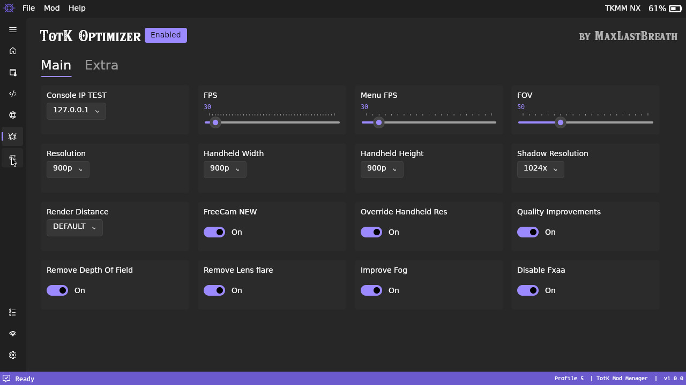

# TKMM on the Switch

    
     

 

## Prerequisites

1. Tears of the Kingdom base game and update ([1.1.0 or later](../faq/#why-cant-i-use-version-100)) either installed on your SD card or dumped with [nxdumptool](https://github.com/DarkMatterCore/nxdumptool/releases/tag/rewrite-prerelease) (as an XCI or NSP file).
2. [Lockpick_RCM](https://github.com/impeeza/Lockpick_RCMDecScots/releases/latest/download/Lockpick_RCM.bin) (For dumping your keys)
3. [nxdumptool](https://github.com/DarkMatterCore/nxdumptool/releases/tag/rewrite-prerelease) (Only required if your game/update is a cartridge, or installed to internal memory)
4. [Hekate](https://github.com/CTCaer/hekate/releases/latest) (Download the latest `hekate_ctcaer_<version>.zip` release of Hekate)

 

## Preparation

### 1. SD Card Setup 

To install TKMM-NX, 

- Download [`tkmm-nx.zip`](https://github.com/TKMM-Team/TKMM-NX/releases/latest/download/tkmm-nx.zip) and extract it to the root of the SD card (or install it later from the Homebrew app store).
- Install [Lockpick](https://github.com/impeeza/Lockpick_RCMDecScots/releases/latest/download/Lockpick_RCM.bin) by copying `Lockpick_RCM.bin` to the folder `/bootloader/payloads` on your SD card and overwrite it if already existing (if you already had Lockpick, you still need to download the latest version and replace it).
- Extract `hekate_ctcaer_(version).zip` to the root of the SD card (replace existing files if prompted).

 

### 2. Dumping Keys

To dump the Switch's keys, open the Payloads section in Hekate and launch `Lockpick_RCM.bin`, then select either `Dump from SysNAND` if you play the game on SysMMC, or `Dump from EmuNAND` if you play the game on EmuMMC. (Use the power button to select and volume up/down to navigate.)

If you already dumped your keys prior to following this tutorial, you still need to redump them using the latest version of Lockpick.

If your Switch firmware receives a major update in the future (e.g. going from 21.x.x to 22.x.x), you will also need to redownload the newest version of Lockpick and redump the keys again.

 

### 3. Ensure Tears of the Kingdom is Accessible

TKMM-NX needs access to the base game and update data (version `1.1.0` or later) in order to function, as well as the Switch's keys to decrypt them.

To determine where the base game and update data are installed, refer to `Data Management` > `Manage Software` > `Tears of the Kingdom` in the Switch's settings.

    

If both `Software` and `Update Data` are listed under `microSD Card`, you do not need to dump or move your game to the SD card.

Otherwise, only parts **not installed** on the `microSD Card` require either one of the two solutions below:

- The first method (recommended if you have a digital copy of the game), is to transfer the game from system memory to the SD card. Refer to [this tutorial](./transfer-game/) for more information. **This cannot be done for the base game if your copy is a physical cartridge.**

- The second method (mandatory if your copy of the game is a physical cartridge) is to dump the game to the SD card. Refer to [Dumping Tears of the Kingdom](./dumping/) for more information. This method is inefficient for digital copies of the game, because you will end up with the game stored both on system memory **and** the SD card.

 

## Installation

### Installing from the Homebrew App Store

If TKMM-NX was not installed in the [preparation](#preparation) section by extracting it to the SD card, it can be installed from the Homebrew App Store (under the advanced category).

    

 

### Post-Installation Setup

If TKMM-NX is installed correctly, a boot entry for `TKMM` will appear under `More Configs` in Hekate.

    

The first time TKMM-NX is opened, the setup wizard will appear. If the [preparation](#preparation) section was done correctly, no additional setup will be required.

    

If the setup wizard cannot find the keys or the game/update, review the steps in the [preparation](#preparation) section.

If you get kernel errors, or any L4T errors preventing you to boot into TKMM-NX (`wrong image format for bootm command`, or `failed to load kernel` for example), refer to the [Troubleshooting page](./troubleshooting/).

 

#### Network Setup (Optional)

To enable the GameBanana mod browser and other network features, TKMM-NX must be connected to the internet.

To connect to a wireless network, navigate to the network page (Wi-Fi icon on the bottom left) and select `Connect` on a wireless network. Enter the password if needed, and wait for the status to change to `Connected`.

    

> [!NOTE]
> If network features aren't working, ensure that `WiFi Enabled` is toggled `ON` under `Services`.

 

## Using TKMM-NX

### Installing Mods

Mods can be installed from either the built-in GameBanana browser or by selecting files on your SD card.

Refer to the [Using Mods](../docs/using-mods/) page for more information on how to install mods with TKMM.

> [!IMPORTANT]
> On Switch firmware 20.0.0 and higher, enabling the [TotK Optimizer](#integrated-totk-optimizer--ultracam) is mandatory, otherwise the game will crash at launch.
> 
> After making any changes to the mod list, you must click `Apply` on the home page for changes to take effect.

 

### Leaving TKMM-NX

To reboot to Hekate, select `Reboot` from the `TKMM-NX` menu at the top right.

    

For convenience, it is also possible to press the `Home button` to show the Reboot2Config menu allowing you to select which boot entry in Hekate you would like to reboot to. Use the D-Pad to navigate between available options, or simply swipe up and down to switch pages.

    

 

### Additional Information

- Pressing the `Capture button` will create a screenshot in the `tkmm/screenshots` folder on the SD card.
- Providing logs is required for requesting assistance, those are located in `tkmm/Logs` on the SD card.

For more detailed help on how to use TKMM, please refer to the [documentation](https://tkmm.org/docs), or join the [TKMM Discord server](https://tkmm.org/discord).

 

## Integrated TotK Optimizer / Ultracam

[MaxLastBreath](), the developer of the TotK Optimizer ([Ultracam](https://gamebanana.com/mods/480138)), has allowed the TKMM Team to use his mod and directly integrate it into TKMM.

It can be enabled from the `TotK Optimizer` page on the left (star icon). Keep in mind, the Switch may not be able to boot the game if you select any resolution higher than 1080p and 60 FPS.

> [!NOTE]
> You do not need to install [Ultracam](https://gamebanana.com/mods/480138) separately, as it is already integrated into the TotK Optimizer page. For users with access to the beta versions, install the TKCL file provided on the official [NX Optimizer Discord Server](https://www.nxoptimizer.com/discord). (See [Using Mods](../docs/using-mods#installing-mods) for installing TKCL files.)

    

For more information, visit the [official website](https://www.nxoptimizer.com/games/tears-of-the-kingdom/) of the optimizer and get a better idea of what this mod is and how best to configure it for your Switch.

All assistance requests related to the optimizer should be directed to the [Discord server for the optimizer](https://www.nxoptimizer.com/discord).

---

*This guide is based on the original Game Banana tutorial by [lordbubbles](https://ko-fi.com/lordbubbles), consider supporting him on [KoFi](https://ko-fi.com/lordbubbles).*

    
     

