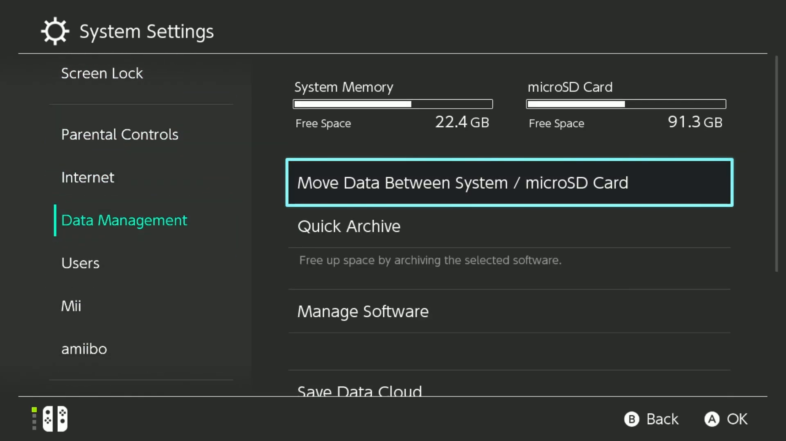
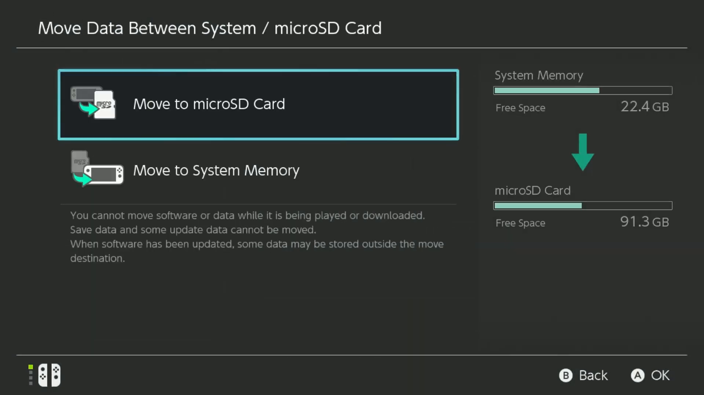
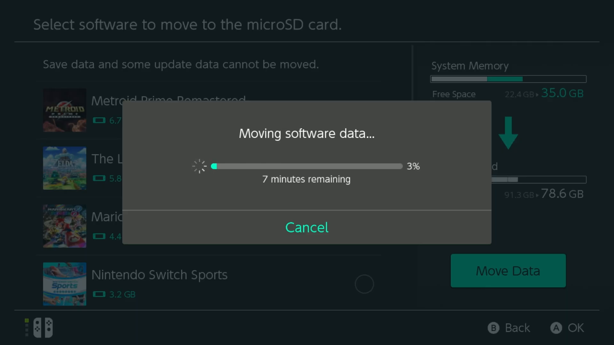

# Transfer TotK from System Memory to microSD Card

 

In order to transfer the game from system memory to the SD card, open to the Switch settings and go to the `Data Management` section, then select the option `Move Data Between Console/microSD Card`

    

On that menu, select the option `Move to microSD Card`

    

Finally, select `The Legend of Zelda: Tears of the Kingdom` in the list of games, and press Move Data

    

 
