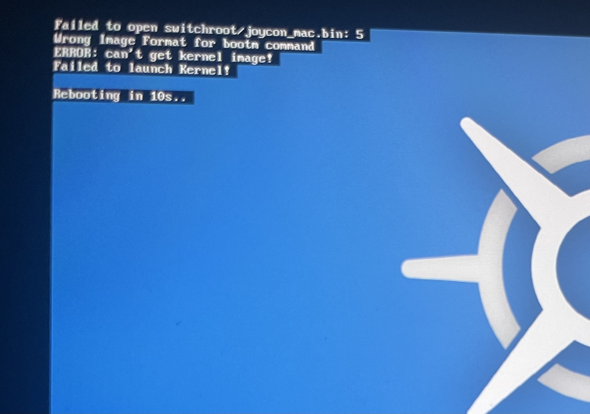
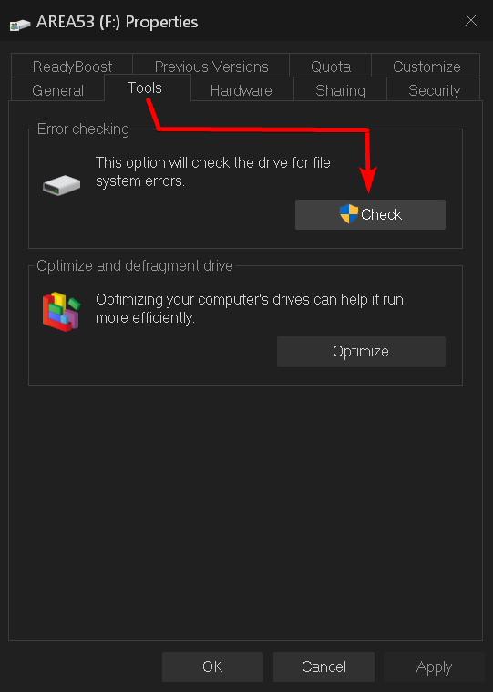

# Troubleshooting TKMM-NX booting issues

 

    

 

If you get errors preventing you from booting into TKMM-NX (`wrong image format for bootm command`, or `failed to launch kernel` for example), there are several possible reasons:

- files can get corrupted when transferred with a bad USB cable, or faulty microSD adapter.
- the file system of the SD card can get corrupted if it not ejected properly.
- the SD card may just be incompatible (check compatibility guide link at the bottom of this page).

 

> [!NOTE]
> The warning `Failed to open switchroot/joycon_mac.bin` can be safely ignored.
>
> This troubleshooting section only concerns booting issues, not setup or game dump issues.

 

Try either of the two methods below to fix the boot errors.

 

## Method #1: Scanning and repairing the SD card

If your PC is on Windows, plug your micro SD card to your PC, either by using an adapter, or with a USB cable (using Hekate UMS on your Switch). Then, right click the SD card in your File Explorer and go to `Properties`. Inside the properties window, go to the `Tools` tab and press the `Check` button (see screenshot below). This will scan the SD card for corruption issues and repair them.

    

If your PC is running Linux or macOS, follow [this guide](https://wiki.hacks.guide/wiki/Checking_SD_card_integrity).

After doing so, you may try to boot to TKMM-NX again and see if the boot issues are fixed. If not, try reinstalling TKMM-NX using a different file transfer method, like FTP, or Hekate UMS (with the best quality cable you can find), or directly install it from the Homebrew App Store.

 

## Method #2: Formatting the SD card

If nothing works at all, you may attempt the steps described below. 

- 1. connect the Switch to your PC with a USB cable, then in Hekate, go to `Tools` > `USB Tools` > `SD Card`
- 2. extract `tkmm-nx.zip` to the SD card's root again (overwrite all files), eject the SD card safely, and try booting to TKMM-NX again
- 3. if that still didn't work, return to Hekate UMS and copy all files from the SD card to a folder somewhere on your PC
- 4. after all transfers are completed, right click the SD card on your PC and select "Eject"
- 5. go to `Tools` > `Partition SD Card` in Hekate
- 6. leave everything on the default settings, and click "Next Step"

> [!IMPORTANT]
> **THE STEPS DESCRIBED BELOW WILL ERASE THE SD CARD, IF YOU HAD A SPECIFIC PARTITION LAYOUT FOR EMUMMC OR LINUX/ANDROID THEN USE AN EXTERNAL TOOL TO WIPE THE FAT32 PARTITION ONLY**
>
> **WE DO NOT TAKE RESPONSIBILITY FOR ANY LOSS OF DATA, PROCEED AT YOUR OWN RISK.**

- 7. validate when it asks you to confirm if you really want to erase everything
- 8. go back to the USB tool in Hekate
- 9. copy all files back from your PC to the SD card
- 10. go to `More Configs` in Hekate and try to boot to TKMM-NX again

 

## SD Card Compatibility

If none of the methods provided helped fix the boot errors, it is highly likely that your SD card is simply incompatible (check the [Switchroot SD card guide](https://wiki.switchroot.org/wiki/sd-card-guide)). You may need to acquire a new SD card to get TKMM-NX working on your Switch, if so, the Samsung Pro ones are the most recommended.

Alternatively, you may use the [Desktop version](../../docs/) of TKMM on your PC, and export the mods to your SD card.